<style>
h1.title { color: #D95319; }
</style>

---
title: "NightGlow Design Walkthrough"
subtitle: "<b>System Architecture and Design Methodology of a Smart Nightlight</b>"
format: html
css: styles.css
self-contained: true # Embed all JS/CSS
page-layout: full
toc: true
toc-location: right
toc-title: "Table of Contents"
toc-depth: 5
toc-expand: true
author: "PrinceOfDuloc"
---

| Rev |    Date    | Description                       |
|-----|:-----------|----------------------------------:|
|  A  | 18.08.2026 |                  Prototype Design |
: Revision Modification Log

# 1. INTRODUCTION

NightGlow is an advanced, energy-efficient nightlight designed for residential hallway illumination. Its primary function is to provide sufficient visibility for safe navigation during nighttime hours, such as when occupants wake up and move through the house in low-light conditions.

The light output is continuously adjustable, ranging from complete darkness up to approximately 1000 lumens—comparable to the output of a typical 10 W LED bulb. NightGlow achieves this brightness with a maximum power consumption of only 5 W, significantly improving energy efficiency—an essential factor for always-on lighting applications.

The device features a user-adjustable knob and a multi-function button: The knob sets the LED brightness level, while the button defines the ambient illuminance threshold at which the LEDs automatically turn on or off. The button is also used to change a few configuration settings detailed in the Firmware Design section. In addition, a motion sensor is used for occupancy detection; if no motion is detected for a configurable amount of time, the LEDs are automatically turned off to eliminate unnecessary power consumption.

[GitHub Repository](https://github.com/PrinceOfDuloc/NightGlow)

**Scope:** Unlike a conventional application note, this document is intended to serve as an engineering journal. It documents the complete design process, including the underlying calculations, design decisions, trade-offs, experiments, observations, and subsequent revisions. The emphasis is placed on the engineering reasoning behind the final design rather than presenting only the completed implementation.

# 2. HARDWARE DESIGN

The electronics design integrates illumination, sensing, control, and power management into a compact and cost-effective system. High-efficiency, low power-density 3000 K LEDs were selected to achieve uniform light output and thermal distribution while making effective use of the available PCB area. Ambient light is measured using a photodiode with a transimpedance amplifier, enabling the MCU to periodically disable the LEDs and accurately sample environmental illuminance through its ADC. Occupancy detection is implemented using a mmWave radar type motion sensor. LED brightness is controlled via a step-down (buck) constant-current LED driver, providing efficient and linear dimming over the full operating range. Power for circuit components other than the LEDs is supplied by a capacitive dropper, while a linear regulator generates a regulated 5 V rail for the control and sensing circuitry. Overall, the design prioritizes electrical efficiency, thermal robustness, and low system cost while meeting the functional requirements of the application.

#### Notes {.unlisted}
**GND:** Circuit DC ground, i.e., the negative terminal of the rectifier bulk capacitor. <br>
**Earth:** Protective Earth (PE). It is not electrically connected to the DUT, but serves as the reference ground for the test equipment used in bench tests.<br>
**Rectified AC Bus:** The positive terminal of the rectifier bulk capacitor.<br>
**About Probes:** As only one differential probe was available, it was reserved for critical analog waveform measurements. Passive probes were used only for digital or non-fluctuating analog signals, where the additional measurement noise is acceptable. Noise is present due to ground clip being disconnected in mains powered measurements. Since the ground clip of a passive probe is Earth-referenced, connecting it to a non-isolated circuit node may create a short circuit and permanently damage the DUT or the test equipment.<br>
**Bench Test Code options:**<br>
- Code 1 – Verified as Designed<br>
- Code 2 – Verified with Foreseen Tuning<br>
- Code 3 – Verified with Minor Modifications<br>
- Code 4 – Redesign: Major Modification Required<br>
- Code 5 – Failed and Unresolved<br>
- Code 6 – Not Testable<br>
- Code 7 – Testing Aborted Due to Another Cause<br>

#### SCHEMATIC
[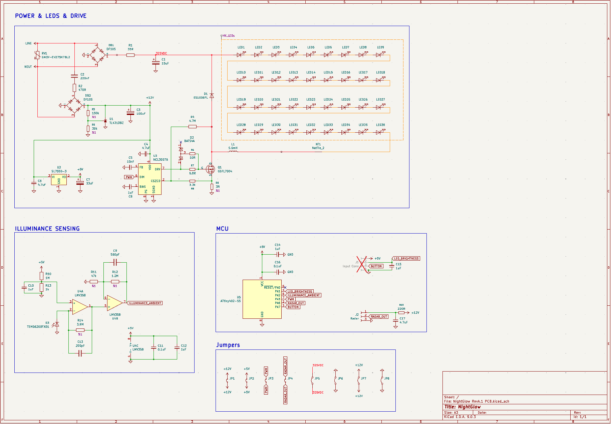](NightGlow Design Walkthrough_files/images/Schematic.png)

::: {.callout-note collapse="false"}
#### Note
After the Hardware Design section was completed, some component values were revised based on the experimental results presented in Section 6 and are documented in Section 7. The schematic shown here incorporates those revisions and may therefore differ from the detailed design presented in this section.
:::

## 2.1 LEDs
The starting point for color selection is natural white light (approximately 4000 K). Since the application is a night light, a calming visual effect is desired, which generally favors lower color temperatures. However, excessively warm (yellow) light may be undesirable to some users and can significantly alter the perceived colors of surrounding objects. Because the light is intended to operate continuously, it is important to minimize distortion of ambient color perception. These requirements suggest remaining close to the natural white region while still achieving a warmer, more relaxing tone. Based on these considerations, a color temperature of **3000 K** was selected as a compromise between warmth and color neutrality, providing a calming appearance without excessive yellow coloration.

The device is not intended for mass production; therefore, LED component cost is considered flexible. This allows the use of LEDs with approximately twice the efficiency of typical commercial-grade devices, selected to achieve an optimal balance between efficiency and performance. Furthermore, higher LED efficiency reduces power dissipation and associated heat generation. Reduced thermal output is particularly beneficial in this design, as it minimizes temperature-induced errors in the photodiode which is the primary element in the luminosity sensing circuit. A luminous efficacy greater than **190 lm/W** was found to be suitable.

The most cost-effective component meeting the criteria was selected.

**LED:** JB2835BWT-N-H30EA0000-N000P001 - Cree LED

*Specs:* Vf = 2.7V, If = 55mA, Efficacy = 202 lm/W, Flux @25°C = 30lm

If 4000 K version is desired, JB2835BWT-N-H40EA0000-N000P001 in the same series can be used.

## 2.2 Power Supply / LED Driver
The system power budget is dominated by the LED load, with minor contributions from the control logic and sensing circuitry. Since the load consists of LEDs, the power supply controls the output current instead of the voltage. The LEDs are connected in series, ensuring identical forward current through each. This configuration results in a power supply requirement characterized by a high output voltage and low output current. Transformerless topology is chosen because: Galvanic isolation is not required for this application, output current is low and transformers are costly. Therefore, the power supply is designed in buck topology with current regulation. Auxiliary power for the power management IC (PMIC), control logic, and sensing circuitry is derived using a capacitive dropper. The PMIC is powered directly from the capacitive dropper output. An additional low-dropout regulator (LDO) is employed to further regulate and reduce the voltage supplied to the logic and sensing circuits, ensuring stable operation within their specified voltage limits.

LED brightness is controlled via PWM dimming applied to the LED driver control input. At higher PWM frequencies, dimming accuracy can degrade due to internal switching and control delays. For this design, a PWM frequency of 2 kHz was selected, which provides stable dimming behavior while remaining well above the flicker perception threshold for humans and domestic animals.

###### Power Supply Parameters: {#pwr-supply-param}

Unlike the other parameters, the allowable LED current cannot be determined at this stage, as it depends on the thermal resistance from the LED junction to ambient, which is strongly influenced by the PCB layout. During the preliminary design phase, before a PCB is available, the LED current is therefore set to the manufacturer's recommended test current of 55 mA. The final value must be determined [experimentally](#exp-max-led-current) after at least one prototype PCB has been assembled. The LED junction temperature cannot be measured directly; therefore, a conservative maximum LED package (surface) temperature must be selected instead. Since the LEDs are rated for a maximum junction temperature of 125 °C, a maximum package temperature of 60 °C is considered a conservative design limit.

```{python}
from math import pi, sqrt, sin, cos, radians # Needed for calculations

V_AC_RMS = 230
f_AC = 50
VDC_LOGIC = 5 # Needed for calculation regarding logic circuitry
V_LED = 2.7
N_LED = 36
I_LED = 0.055
eff_trgt = 0.9 # target efficiency

V_IN = V_AC_RMS * sqrt(2)
V_LEDs = N_LED * V_LED
P_Out_MAX = N_LED * V_LED * I_LED
```

### 2.2.1 LED Driver and Power Switch Selection
Three main control methods are commonly used in step-down LED drivers: Hysteretic (Peak–Valley), constant off-time (which is typically associated with discontinuous-conduction-mode (DCM) operation), BCM or Quasi-resonant.

**Hysteretic (peak–valley) Current Control** operates in continuous conduction mode (CCM), where the inductor current never reaches zero. While CCM provides good current regulation and predictable EMI behavior, it is not well suited for applications below 25W such as this. At the required LED current level, CCM would demand a relatively large inductance to limit ripple current, increasing component size and cost without offering meaningful performance or efficiency benefits. For these reasons, CCM hysteretic control is not considered further.

**Constant Off-Time Control** can be implemented in both CCM and DCM; however, for this application it would most naturally operate in DCM. The simplest and most cost-effective method of LED current regulation is peak current sensing, where the peak inductor current is used to infer the average LED current. A peak-current–mode LED driver can regulate current accurately only if there is a deterministic relationship between peak inductor current and average LED current. This condition holds in CCM and BCM. In DCM, the presence of uncontrolled zero-current dead time breaks this relationship, making average LED current dependent on operating conditions that are not sensed by the controller. For these reasons, DCM control is not considered further.

**Boundary conduction mode (BCM)** is therefore selected as the optimal operating mode. BCM represents the lowest-current operating condition in which the average LED current remains uniquely defined by the peak inductor current. At the same time, BCM allows the use of a smaller inductor compared to CCM and naturally enables zero-current switching, improving efficiency. BCM control can be further enhanced by *quasi-resonant (QR)* operation, in which the controller turns the MOSFET on after the inductor current reaches zero and at a drain-source voltage valley. This minimizes the MOSFET turn-on voltage, significantly reducing switching losses and EMI. For this application, the combination of BCM and QR operation provides accurate LED current regulation, high efficiency, and minimal component size.

Below, the switching losses in BCM operation without quasi-resonant switching are calculated to assess the necessity of QR operation. For this purpose, the lowest-cost suitable QR buck LED driver, *NCL30076AADR2G - onsemi*, is identified as a reference. Cheaper alternative BCM LED driver PMICs are then surveyed. Among the available devices, *HV9910CLG-G - Microchip Technology* is identified as the only viable non-QR BCM controller; therefore, the switching loss calculations presented in this section are based on this device.

###### Switching Loss Analysis for Driver Concept:
```{python}
# PARAMETERS
I_source = 0.165
I_sink = 0.165
Qtot = 6e-9 # MOSFET total gate charge 8.8nC @480VDS -> 6nC @325V assumed
V_GS_ON = 7.5
f_sw_MAX = 150e3

tr = Qtot/I_source
tf = Qtot/I_sink

# CALCULATION
P_Loss = 1/2 * V_IN * I_LED * (tr+tf) * f_sw_MAX
L = V_LEDs*(1-V_LEDs/V_IN)/(2*I_LED*f_sw_MAX)

# DISPLAY
print(f"Switching Losses without QR is {P_Loss:.3f} W -> %{P_Loss/P_Out_MAX * 100:.2f} of the output power")
print(f"In this case, tr= {tr*1e9:.0f} ns, tf= {tf*1e9:.0f} ns, L = {L*1e3:.1f} mH")
```

The total switching loss is minor, making the HV9910 a technically viable option. However, it cannot operate in true boundary-conduction mode because it does not directly sense or control the inductor current while the MOSFET is off. Instead, it uses a fixed off-time control scheme, which results in operation near the BCM boundary but not exactly at it. Consequently, although likely imperceptible to the user, LED brightness may vary from unit to unit due to tolerances in the inductor, timing components, and internal thresholds. In addition, Microchip Technology’s pricing policy does not offer significant discounts at volume quantities. Even at quantities as low as 100 units, the cost nearly matches that of its QR counterpart. Therefore, there is little justification to adopt this particular PMIC.

Another lower-cost QR PMIC, AL1665S-13 — Diodes Incorporated, was considered. However, this device is intended for flyback or buck-boost topologies rather than a buck converter. Therefore, to avoid unnecessary design complexity and potential integration issues, a controller specifically designed for buck applications is preferred.

There are buck controllers with and without internal switches. The internal switches of offline buck LED drivers typically have an on-resistance of around 4 Ω, which results in approximately 5% power loss. A cheap, line-voltage-rated MOSFET can reduce the on-resistance to around 1 Ω. Having a separate external switch also allows for a wider selection of controllers, since the PMIC supply voltage no longer needs to be compatible with the line voltage. Consequently, a controller without an internal switch is chosen, along with a low-cost external MOSFET with an on-resistance of 1.3 Ω.

**PMIC:** NCL30076AADR2G - ONsemi

**MOSFET:** GSFL7004 - Good-Ark Semiconductor

### 2.2.2 LED Driver Design

#### 2.2.2.1 Offline Buck Converter Design

Refer to the NCL30076 datasheet for the calculation derivations below:

```{python}
# PARAMETERS
L = 5.6e-3 # Initially designed for 4.7 mH but that value was out of stock
V_IN_MAX = 1.15 * V_IN
V_IN_MIN = 0.85 * V_IN
C_bulk_ripple = 0.10 # peak to peak ripple ratio
VDIM = 1.8

# AC BCM BUCK TOPOLOGY CAL
ILpk = 2*I_LED
fsw= 1/(L*ILpk) * (V_IN-V_LEDs)*V_LEDs / V_IN
D = V_LEDs/V_IN
ton = D/fsw
C_bulk_MIN = P_Out_MAX / ((V_IN_MIN**2 - ((1-C_bulk_ripple)*V_IN_MIN)**2) * eff_trgt * f_AC)

# PMIC Specific CAL
R_CS = (VDIM - 0.2) / (10 * I_LED) # Formula from datasheet

# PMIC SANITY CHECK CALC
# The following calculations do NOT represent controllable variables. Only to verify that the implied operating point remains within datasheet limits.
V_CS_LIM = ILpk * R_CS # In steady-state quasi-resonant mode
VFB = (V_CS_LIM - 0.0375) * 10 
T_OFF_FB = (2.7/(VFB-1.1) + 0.1)*1e-6 # DCM switching threshold, if inductor current drops to zero before this time DCM is enforced
T_OFF_FB_MAX = L*ILpk/V_LEDs # di/dt_off = V_LEDs/L -> t_off = L*ILpk/V_LEDs | di/dt_on = (V_IN-V_LEDs)/L -> t_on = L*ILpk/(V_IN-V_LEDs)


# DISPLAY
print(f"fsw = {fsw*1e-3:.0f} kHz | D = {D:.2f} | ton = {ton*1e6:.3f} us")
print(f"RCS = {R_CS:.3f} Ω")
print(f"Implied VFB = {VFB:.3f} V (MIN: 1.1V, MAX: 3.43V)") # bounded by datasheet
print(f"Implied V_CS_LIM = {V_CS_LIM:.3f} V (MAX: 0.410V)") # bounded by datasheet
print(f"Implied T_OFF_FB = {T_OFF_FB*1e6:.3f} us (MIN: 1.25us, MAX: {T_OFF_FB_MAX*1e6:.1f}us)") # MIN: bounded by datasheet, MAX: IL fall time
print(f"Bridge Rectifier Diode shall be minimum {1.5*V_IN_MAX:.0f} V and {P_Out_MAX/(V_AC_RMS*eff_trgt):.3f} A")
print(f"C_bulk > {C_bulk_MIN*1e6:.0f} uF")
print(f"MOSFET & Freewheeling diode rating > {1.5*V_IN_MAX :.0f} V & {1.5*ILpk:.3f} A")
```


::: {.summary-box}
Bench Test Code: **7 – Testing Aborted Due to Another Cause**

[Exp. 15 - Buck Converter Operation](#exp-buck-dtl)
:::

#### 2.2.2.2 Zero-Current Detection
 The CSZCD pin uses a resistor divider to sense the drain-voltage valley. The divider must provide sufficient voltage swing for reliable detection while ensuring that the CSZCD pin voltage remains below its maximum rating of 5.5 V. Since the datasheet does not specify exact design requirements for this divider, the values are determined empirically.

As a starting point, the *100-W Quasi-Resonant (QR) using NCL30076 - TND6338/D* reference design is used as a guideline. In that design, the resistor divider produces a CSZCD pin voltage of

$$
V_{\mathrm{CSZCD}} = 400\,\text{V} \cdot \frac{1.5\,\text{k}\Omega}{2.6015\,\text{M}\Omega} \approx 230\,\text{mV}
$$

The same CSZCD pin voltage is maintained in the present design, while adapting the divider for a drain voltage of 325 V. Choosing $R_{\mathrm{ZCD2}} = 3.3\,\text{k}\Omega$, the corresponding value of $R_{\mathrm{ZCD1}}$ is calculated as

$$
R_{\mathrm{ZCD1}} =
2.6\,\text{M}\Omega
\cdot \frac{3.3\,\text{k}\Omega}{1.5\,\text{k}\Omega}
\cdot \frac{325\,\text{V}}{400\,\text{V}}
\approx 4.7\,\text{M}\Omega
$$

::: {.summary-box}
Bench Test Code: **7 – Testing Aborted Due to Another Cause**

[Exp. 12 - Zero-Cross Detection Divider Network](#exp-zcd)
:::

#### 2.2.2.3 MOSFET Gate Resistor {#dsgn-gate-resistor}
The required gate resistor values are difficult to determine analytically, as they depend on multiple poorly defined parameters, including device parasitics, package characteristics, and PCB layout–dependent inductances and capacitances. Consequently, the gate resistors are selected empirically through experimental evaluation.

For turn-on, the gate network is adjusted to achieve a slightly underdamped gate voltage response, providing a controlled transition while avoiding excessive overshoot. For turn-off, the resistor value is minimized to the lowest level that does not induce ringing on the drain node, thereby balancing switching speed with electromagnetic compatibility (EMC) performance.

::: {.summary-box}
Bench Test Code: **7 – Testing Aborted Due to Another Cause**

[Exp. 11 - Gate Resistor Selection](#exp-gate-resistor)
:::

#### 2.2.2.4 Feed-Forward Resistor: 

This resistor is required when the output voltage range is wide. Variations in output voltage change the inductor current slope, which in turn affects the internal CSZCD sampling accuracy. The purpose of the feed-forward resistor is to compensate for this slope-dependent error. The resistor is omitted on the PCB because the chosen dimming method is PWM in which the output voltage remains constant. Nevertheless, its effect is evaluated during prototype testing. As a ballpark value, $60\text{M}\Omega$ obtained from the *'NCL30076 DESIGN TOOL.XLSX'* is used.

::: {.summary-box}
Bench Test Code: **7 – Testing Aborted Due to Another Cause**

[Exp. 13 - LED Driver Feedforward Resistor Effects](#exp-feedforward)
:::

#### 2.2.2.5 LED Shunt Capacitor: 
A capacitor (CLED) connected in parallel with the LEDs is included in the reference design (TD6338-D) to reduce the LED current ripple. In this design, the capacitor is intentionally omitted because the LED load in this design is low power and the expected current ripple is already sufficiently small. As a result, little to no practical improvement in LED performance or visual output is anticipated, making the additional component unnecessary.

::: {.summary-box}
Bench Test Code: **7 – Testing Aborted Due to Another Cause**

[Exp. 14 LED Shunt Capacitor Effects](#exp-shunt-cap)
:::

<br>

### 2.2.3 Power Factor Considerations
The LED driver is essentially a switched-mode power supply (SMPS) consisting of an input rectifier followed by a bulk storage capacitor. This topology results in a highly non-sinusoidal input current waveform with significant harmonic content, as illustrated in the figure below.

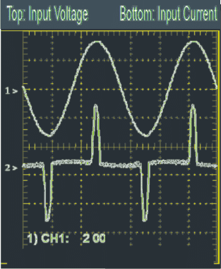

As shown, the line current is drawn in short, high-amplitude pulses around the peaks of the input voltage. The maximum instantaneous input current is therefore much higher than required for the delivered real power, unnecessarily stressing the mains and resulting in a poor power factor.

The relationship between real power and apparent power is given by:

$$
P_{\text{real}} = V_{\text{apparent}} \cdot I_{\text{apparent}} \cdot \cos\varphi \cdot \cos\theta
$$

Here, $\cos\varphi$ represents the displacement factor, which is close to unity in this case because the fundamental components of the input voltage and current are nearly in phase. Consequently, the low power factor is not dominated by phase displacement but rather by the distortion factor, $\cos\theta$, which arises from the highly distorted input current waveform.

Both active and passive techniques can be employed to improve the power factor; however, the selected method must be consistent with the overall product requirements. Given the very low input power level of the system, the use of an active power factor correction (PFC) stage is not justified, as it would add disproportionate cost and complexity relative to the rest of the power supply.

Among passive PFC approaches, placing an inductor in series with the rectifier and bulk capacitor was considered. However, due to the low input current, the inductance required to achieve meaningful current shaping is on the order of several hundred millihenries, resulting in unacceptable size and cost. A valley-fill passive PFC topology was also evaluated, but this method introduces a large input voltage ripple—typically reducing the instantaneous input voltage to approximately half of the peak value each cycle. Such excessive ripple was deemed unnecessary and is expected to negatively impact overall efficiency.

As an alternative passive solution, a simple series resistor placed ahead of the bulk storage capacitor was evaluated. Although this approach introduces resistive losses, it is extremely simple and can be acceptable in low-power systems. Simulation results of an equivalent circuit with and without the resistive PFC element are shown in figures below:

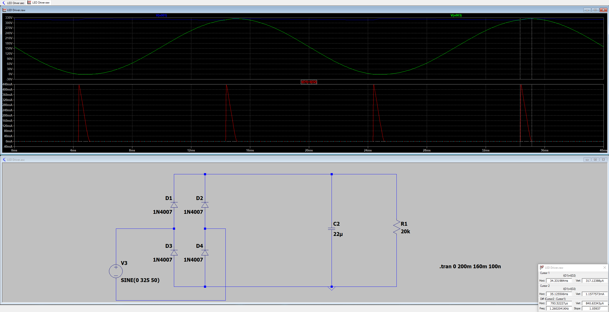

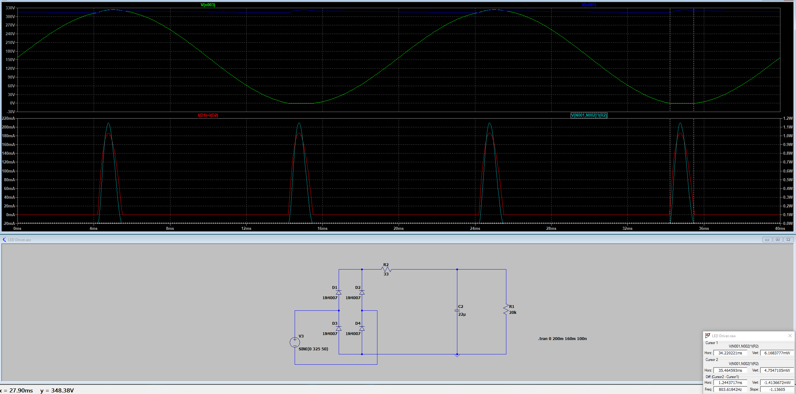

With the addition of a 33 Ω series resistor, the peak input current is reduced from 440 mA to 187 mA (212 mA when a 22 Ω resistor is used), while the conduction interval is extended from 0.79 ms to 1.25 ms. This redistribution of input current over a longer portion of the mains cycle results in significantly improved current spreading and a corresponding reduction in harmonic content.

The power dissipation associated with the resistive PFC method can be approximated by the area under the instantaneous power curve:

$$
P_{\text{Loss}} =
\frac{1}{2} \cdot P_{\text{peak}} \cdot \text{duration} \cdot f
= \frac{1}{2} \cdot 1.15 \cdot 0.00125 \cdot 100
= 72\,\text{mW}
$$

This loss corresponds to approximately 1.5 % of the output power, which is considered acceptable for the targeted low-power LED application.

::: {.summary-box}
Bench Test Code: **7 – Testing Aborted Due to Another Cause**

[Exp. 16 - Power Factor Correction Effects](#exp-pf)
:::


### 2.2.4 Auxiliary Power Supply (Capacitive Dropper)

The auxiliary power supply provides low-voltage power to the PMIC, MCU and sensor, which together have minimal current requirements. As this supply is intended only for control and logic circuitry, a compact and cost-effective solution was prioritized over high efficiency or high power capability.

A capacitive dropper topology was therefore selected to derive the auxiliary supply from the AC mains. This approach eliminates the need for magnetic components, reducing size, cost, and component count while adequately meeting the low-power demands of the system.

###### Capacitive Dropper Calculations:
```{python}
# PARAMETERS
I_dropper_MAX = 6.5e-3 + 2e-3 + 3e-3 # PMIC + MCU + Radar
R_rush = 470
Vf_diode_dropper = 0.7
Vref_TL431 = 2.495
Iref_TL431 = 2e-6
R_Up_TL431 = 150e3
R_Low_TL431 = 39e3
V_dropper_ripple = 1.5 # Allowed ripple voltage from the average

# CALCULATION 
Xc = V_AC_RMS/I_dropper_MAX + R_rush # required Reactance
C_dropper_MIN = 1/(2*pi*f_AC*Xc)
C_dropper_chosen = 220e-9
Vo_dropper = Vref_TL431 * (1 + R_Up_TL431/R_Low_TL431) + Iref_TL431 * R_Up_TL431

C_filter_MIN = I_dropper_MAX  / (V_dropper_ripple * 2*f_AC)

I_dropper_IN_RMS = V_AC_RMS/Xc
P_loss_dropper = I_dropper_IN_RMS**2 * R_rush + 2 * Vf_diode_dropper * I_dropper_IN_RMS

# DISPLAY
print(f"C_dropper_chosen = {C_dropper_chosen*1e9:.0f} nF (MIN: {C_dropper_MIN*1e9:.0f} nF)")
print(f"C_filter_MIN = {C_filter_MIN*1e6:.0f} uF")
print(f"P_loss_dropper = {P_loss_dropper:.3f} W")
print(f"Capacitive Dropper Output Voltage = {Vo_dropper:.2f} V")
```

::: {.summary-box}
Bench Test Code: **4 – Redesign: Major Modification Required**

[Exp. 6 - Capacitive Dropper Regulation](#exp-dropper)
:::


### 2.2.5 Linear Regulator

An additional low-dropout regulator (LDO) is employed to further regulate and step down the voltage supplied to the MCU and sensor, ensuring a stable and low-noise power rail.

###### Criteria:
**Input Voltage:** >= 24 V<br>
**Output Voltage:** = 5V<br>
**Quiescent current** <= 1 mA<br>

The lowest cost part that complies the criteria is chosen.

**LDO:** SL7550-3 - Shenzhen Slkormicro Semicon Co., Ltd.

## 2.3 Ambient Light Sensor

Ambient illuminance is measured using an exposed photodiode positioned to directly sense environmental light levels. To determine whether artificial illumination is still required, the MCU periodically disables the LEDs for a short interval of 5 ms once per minute. This brief interruption prevents self-illumination from influencing the measurement while remaining imperceptible to the user.

The photodiode generates a current proportional to incident light, which is converted to a voltage and amplified using a transimpedance amplifier. The resulting signal is sampled by the MCU’s ADC to estimate ambient illuminance and make control decisions.

Given the intended operating environment of dimly lit indoor spaces, the sensing range is optimized for illuminance levels between approximately 10 lux and 200 lux, providing sufficient resolution and accuracy within the relevant range. The final threshold values must be determined experimentally due to several uncertainties in the optical system, most notably the unknown light attenuation introduced by the diffuser covering the ambient light sensor.

###### Photodiode Selection Criteria
**Peak Sensitivity Wavelength:** ~ 555 nm (Selected to closely match the peak sensitivity of the human eye under photopic conditions.)<br>
**Dark Current:** >= 1 nA (to minimize offset error and noise in the transimpedance amplifier, improving low-light measurement accuracy.)<br>

Cost effectiveness and component availability were also considered in the device selection. Based on these criteria, two photodiodes were identified as suitable candidates: VTP9812FH from Excelitas Technologies and TEMD6200FX01 from Vishay.

The VTP9812FH exhibits a relatively high junction capacitance (150 pF at 10 V). Furthermore, the datasheet specifies junction capacitance only at a reverse bias of 10 V, whereas the intended operating voltage in this design is significantly lower (approximately 0.1 V to 5 V). As junction capacitance increases with decreasing reverse bias, the effective capacitance under operating conditions is expected to be substantially higher, but is not specified, introducing uncertainty into the design.

In contrast, the TEMD6200FX01 features a junction capacitance of 24 pF at 5 V, and the datasheet provides a capacitance-versus-reverse-voltage characteristic (approximately 60 pF at 0 V). This additional information allows for a more robust and predictable design. The device is also available in an SMD package, simplifying assembly and enabling single-layer PCB implementation. From a cost perspective, the TEMD6200FX01 offers more favorable pricing with increasing production volume, with minimal cost difference compared to the VTP9812FH even at quantities as low as 100 units.

The primary disadvantages of the TEMD6200FX01 are its lower photocurrent per lux and an increase in spectral sensitivity in the infrared region.

**Photodiode:** TEMD6200FX01 - Vishay Semiconductor Opto Division<br>

Due to the simplicity of the application, a low-cost rail-to-rail operational amplifier was selected.

**Op-Amp:** LMV358B-VR - 3PEAK<br>

###### Ambient Light Sensor Calculations:
```{python}
# PARAMETERS

# Photodiode Parameters:
I_10lx = 4e-9
I_200lx = 80e-9
Junction_Cap = 60e-12 # junction capacitance @Vref (10mV)

## Op-amp Parameters
Input_Cap_Diff = 8e-12 # Input Capacitance - Differential Mode
Input_Cap_Com = 7e-12 # Input Capacitance - Common Mode

# Circuit Parameters:
t_sense = 0.005 # Sensing duration
BW = 1/t_sense * 5 # Bandwidth, with margin
Op2_Rfb = 1000000
Op2_inv_Rin = 47000
Op2_Vo_MAX = 4.9 # Limited to not saturate the output
Op1_Vo_MIN = Vref = 0.010 # Op-Amp_1 minimum output voltage, must be greater than minimum Output Voltage Swing


# CALCULATIONS
Op2_Gain = 1 + Op2_Rfb / Op2_inv_Rin
Op1_Vo_MAX = Op2_Vo_MAX / Op2_Gain # Op-Amp_1 maximum output voltage
Op2_Vo_MIN = Op1_Vo_MIN * Op2_Gain # Op-Amp_2 minimum output voltage

Op1_Rfb_Target = (Op1_Vo_MAX - Op1_Vo_MIN) / I_200lx
Op1_Rfb = 2700000
Op1_Cfb_MAX = 1/(2*pi*Op1_Rfb*BW)
Op1_Cfb = 33e-12
Op1_Output_Ratio = (I_200lx * Op1_Rfb + Vref) / Vref
Op1_GBP_MIN = (Junction_Cap + Input_Cap_Diff + Input_Cap_Com) / (2*pi*Op1_Rfb*Op1_Cfb**2) * 5 # Op-Amp minimum Gain-bandwidth product

Op2_Cfb_MAX = 1/(2*pi*Op2_Rfb*BW)
Op2_Cfb = 100e-12
Op2_GBP_MIN = Op2_Gain * BW * 5

R_Divider_Bottom = 2000
R_Divider_Top = (VDC_LOGIC-Vref)/Vref * R_Divider_Bottom


# DISPLAY
print(f"Op-Amp 1 Feedback resistor = {Op1_Rfb*1e-6:.1f} MΩ (Target: {Op1_Rfb_Target*1e-6:.3f} MΩ)")
print(f"Op-Amp 1 feedback capacitor = {Op1_Cfb*1e12:.0f} pF (MAX: {Op1_Cfb_MAX*1e12:.0f} pF)")
print(f"Op-Amp MIN Gain-bandwidth product = {max(Op1_GBP_MIN, Op2_GBP_MIN):.0f} Hz")
print(f"Op-Amp 2 feedback capacitor = {Op2_Cfb*1e12:.0f} pF (MAX: {Op2_Cfb_MAX*1e12:.0f} pF)")
print(f"Op1 Output Ratio = {Op1_Output_Ratio:.1f}, Op2 Gain = {Op2_Gain:.1f}")
print(f"\nTop resistor in reference voltage divider is calculated as {R_Divider_Top:.0f} based on chosen bottom resistor.\nThus the final divider becomes: 1M(Top) & {R_Divider_Bottom/1e3:.0f}k(Bottom)")

```


::: {.summary-box}
Bench Test Code: **3 – Verified with Minor Modifications**

[Exp. 4 - Ambient Light Sensor Electrical Characteristics (External DC Supply)](#exp-als-dc)<br>
[Exp. 10 - Ambient Light Sensor Electrical Characteristics (Mains AC Supply)](#exp-als-ac)
:::


## 2.4 Motion Sensor (Radar)

The objective was to achieve a low-cost, visually unobtrusive motion/presence sensing solution. Micro-motion detection is not required for this application because the device is intended to be placed either in hallways where large motion such as walking occurs, or in rooms as a night light where "Vacancy Timeout Duration" is large. Therefore, a detection sensitivity comparable to that of a PIR sensor, but without a protruding sensor head, was considered sufficient. Therefore, a low-cost radar sensor module was selected.

**Radar Sensor:** RCWL-0516<br>

Radar modules contain RF oscillators and other high-frequency circuitry that draw pulsed current from the supply. As a result, they may inject conducted noise onto the supply rails. Conversely, the RF circuitry itself can also be susceptible to supply disturbances, particularly when powered from a capacitive-dropper supply. For these reasons, the radar module supply is isolated from the main 12 V rail using a two-way low-pass (π) filter consisting of a C-R-C network.

Since no specific interference frequency was targeted, the π filter was designed for the lowest practical cutoff frequency. The existing bulk capacitance on the 12 V rail serves as the input capacitor, while a 4.7 µF ceramic capacitor provides local decoupling at the radar module. A larger ceramic capacitor was not considered cost-effective, as it would provide only marginal additional attenuation.

Although the radar module is specified to operate from 4–28 V, preliminary experiments showed that the tested module performs more reliably when operated at or above around 12 V. The module draws approximately 3 mA, therefore a 220 Ω series resistor introduces a voltage drop of only 3mA×220Ω=0.66V, leaving approximately 11.3 V available at the module, which is considered negligible.

::: {.summary-box}
Bench Test Code: **1 – Verified as Designed**

[Exp. 2 - Radar Sensor Sensitivity (External DC Supply)](#exp-radar-dc)<br>
[Exp. 3 - Radar Sensor Power Rail Interference (External DC Supply)](#exp-radar-interference-dc)<br>
[Exp. 8 - Radar Sensor Sensitivity (Mains AC Supply)](#exp-radar-ac)<br>
[Exp. 9 - Radar Sensor Power Rail Interference (Mains AC Supply)](#exp-radar-interference-ac)
:::


# 3. PCB DESIGN AND LAYOUT

## 3.1 PCB Geometry

Because the lamp enclosure is circular, the PCB is also circular. A circular section in the center is reserved for electronic components and the rest of the PCB houses evenly distributed LEDs and large components that did not fit into the middle between the gaps of LEDs at the top.

The placement is done from the components with highest priority, the LEDs, as even distribution is required for uniform light. See the calculation below for the PCB parameters and geometrical calculation for LED placement.

```{python}
#| code-fold: true
#| code-summary: "LED and zone Positioning"

Rad_PCB = 80 # Radius of PCB in mm
Rad_Elec_sec = 25 # Radius of small circular section in the center for electronics in mm
Ring_Qty = 3 # How many LED rings will there be 
Ring_Rad_L = 75 # Largest LED ring 
Ring_Rad_M = 52.5 # Average of the other two
Ring_Rad_S = 30
# Led Qty is already defined in Power Supply section

N_LED_Ring_L = round(N_LED * Ring_Rad_L/(Ring_Rad_S + Ring_Rad_M + Ring_Rad_L))
N_LED_Ring_M = round(N_LED * Ring_Rad_M/(Ring_Rad_S + Ring_Rad_M + Ring_Rad_L))
N_LED_Ring_S = N_LED - N_LED_Ring_L - N_LED_Ring_M

Angle_LED_Ring_L = 360/N_LED_Ring_L
Angle_LED_Ring_M = 360/N_LED_Ring_M
Angle_LED_Ring_S = 360/N_LED_Ring_S

# 1: clockwise, -1: counterclockwise
dir_S =  1
dir_M =  -1
dir_L = 1

Starting_Angle = Angle_LED_Ring_S / 2 # Global rotation offset for all LED angles
offset_S =  0
offset_M = -Angle_LED_Ring_M / 2
offset_L = -Angle_LED_Ring_L


LEDpos = [[0,0,0] for _ in range(N_LED)]

for i in range(N_LED):
    if i < N_LED_Ring_S:
        LEDpos[i][0] = Ring_Rad_S # radius
        LEDpos[i][1] = dir_S*((i + 1) * Angle_LED_Ring_S) - dir_S*(offset_S + Starting_Angle) # angle
        LEDpos[i][2] = -dir_S*((i + 1) * Angle_LED_Ring_S - 90) + dir_S*(offset_S + Starting_Angle) # orientation
    elif i < N_LED_Ring_S + N_LED_Ring_M:
        j = i - N_LED_Ring_S
        LEDpos[i][0] = Ring_Rad_M
        LEDpos[i][1] = dir_M*((j + 1) * Angle_LED_Ring_M) - dir_M*(offset_M + Starting_Angle)
        LEDpos[i][2] = -dir_M*((j + 1) * Angle_LED_Ring_M - 90) + dir_M*(offset_M + Starting_Angle)
    else:
        k = i - N_LED_Ring_S - N_LED_Ring_M
        LEDpos[i][0] = Ring_Rad_L
        LEDpos[i][1] = dir_L*((k + 1) * Angle_LED_Ring_L) - dir_L*(offset_L + Starting_Angle)
        LEDpos[i][2] = -dir_L*((k + 1) * Angle_LED_Ring_L - 90) + dir_L*(offset_L + Starting_Angle)

#Zone:
Zone_res = 5 # How many points will be created on single edge of a zone
Clearance_M = 2 # Create clearance by removing the Middle section as it has the thickest copper

Zone_S_Pos = [[0, 0] for _ in range(Zone_res*2)]
for i in range(Zone_res*2):
    if i < Zone_res:
        r = (Ring_Rad_S + Ring_Rad_M) / 2
        theta = LEDpos[0][1] + i * Angle_LED_Ring_S / (Zone_res-1)
    else:
        r = Rad_Elec_sec
        theta = LEDpos[0][1] + (i - Zone_res) * Angle_LED_Ring_S / (Zone_res-1)

    Zone_S_Pos[i][0] = r * cos(radians(theta))
    Zone_S_Pos[i][1] = r * sin(radians(theta))


Zone_M_Pos = [[0, 0] for _ in range(Zone_res*2)]
for i in range(Zone_res*2):
    if i < Zone_res:
        r = (Ring_Rad_L + Ring_Rad_M) / 2 - Clearance_M
        theta = LEDpos[N_LED_Ring_M][1] + i * Angle_LED_Ring_M / (Zone_res-1)
    else:
        r = (Ring_Rad_S + Ring_Rad_M) / 2 + Clearance_M
        theta = LEDpos[N_LED_Ring_M][1] + (i - Zone_res) * Angle_LED_Ring_M / (Zone_res-1)

    Zone_M_Pos[i][0] = r * cos(radians(theta))
    Zone_M_Pos[i][1] = r * sin(radians(theta))


Zone_L_Pos = [[0, 0] for _ in range(Zone_res*2)]
for i in range(Zone_res*2):
    if i < Zone_res:
        r = Rad_PCB
        theta = LEDpos[N_LED_Ring_M + N_LED_Ring_L][1] + i * Angle_LED_Ring_L / (Zone_res-1)
    else:
        r = (Ring_Rad_M + Ring_Rad_L) / 2
        theta = LEDpos[N_LED_Ring_M + N_LED_Ring_L][1] + (i - Zone_res) * Angle_LED_Ring_L / (Zone_res-1)

    Zone_L_Pos[i][0] = r * cos(radians(theta))
    Zone_L_Pos[i][1] = r * sin(radians(theta))


# DISPLAY
print(f"Large Ring -> Radius: {f'{Ring_Rad_L:.2f}'.rstrip('0').rstrip('.')} | Qty: {f'{N_LED_Ring_L}'.rstrip('0').rstrip('.')} | Angle: {f'{Angle_LED_Ring_L:.3f}'.rstrip('0').rstrip('.')}°")
print(f"Medium Ring -> Radius: {f'{Ring_Rad_M:.2f}'.rstrip('0').rstrip('.')} | Qty: {N_LED_Ring_M} | Angle: {f'{Angle_LED_Ring_M:.3f}'.rstrip('0').rstrip('.')}°")
print(f"Small Ring -> Radius: {f'{Ring_Rad_S:.2f}'.rstrip('0').rstrip('.')} | Qty: {f'{N_LED_Ring_S}'.rstrip('0').rstrip('.')} | Angle: {f'{Angle_LED_Ring_S:.3f}'.rstrip('0').rstrip('.')}°")

print(f"\nLED[x] = ('Distance','Angle' 'Rotation')")
for i in range(N_LED):
    print(f"LED[{i+1}] = ({f'{LEDpos[i][0]:.3f}'.rstrip('0').rstrip('.')}, {LEDpos[i][1]:.3f}, {LEDpos[i][2]:.3f})")


print(f"\nZone Point Coordinates = ('x','y')")
for i in range(Zone_res*2):
    print(f"Zone_S_point[{i+1}] = ({Zone_S_Pos[i][0]:.3f}, {Zone_S_Pos[i][1]:.3f})")
for i in range(Zone_res*2):
    print(f"Zone_M_point[{i+1}] = ({Zone_M_Pos[i][0]:.3f}, {Zone_M_Pos[i][1]:.3f})")
for i in range(Zone_res*2):
    print(f"Zone_L_point[{i+1}] = ({Zone_L_Pos[i][0]:.3f}, {Zone_L_Pos[i][1]:.3f})")

print(f"*Create all three zones by the given points, revolve them 360 degrees and assign corresponding net for each resulting zone.")
```

[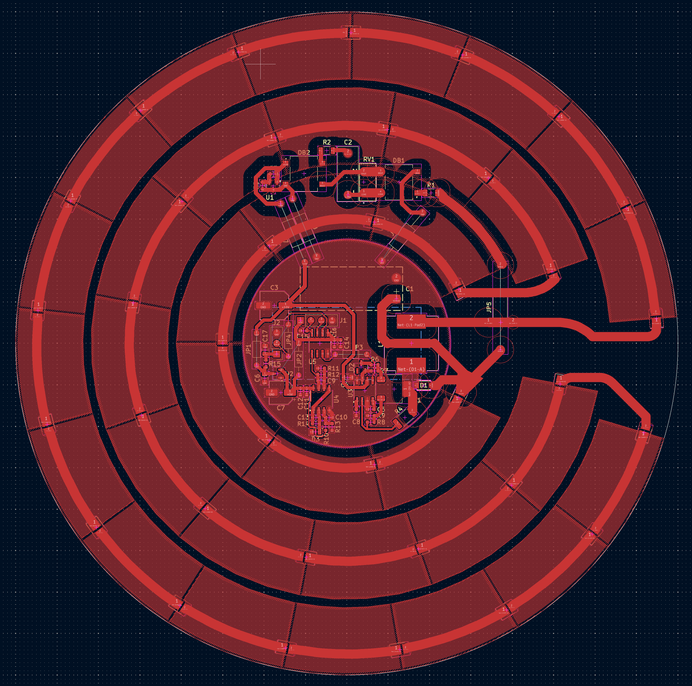](NightGlow Design Walkthrough_files/images/PCB.png)

[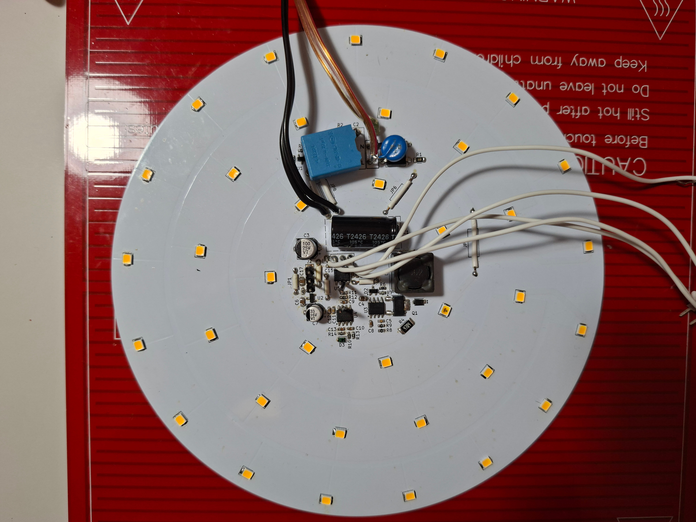](NightGlow Design Walkthrough_files/images/PCB_Assembly.jpg)

::: {.callout-note collapse="false" #post-assembly-notes}
## Post Assembly Notes
**Manufacturability Concern**<br>
The default 2835 LED footprint is designed only to work with reflow ovens or hot-air. Hot air does not melt the solder paste due to the extreme heat conductivity of the large copper areas and aluminum base at the back. Using solely hot-air destroys the LED before the paste flows. A soldering iron cannot reach the pads once the LEDs are placed.

The correct manual soldering method is to preheat the PCB on a hot plate to approximately 110 °C, apply 230 °C hot air with low airflow, and use a 380 °C soldering iron with leaded solder.
:::

::: {.summary-box}
Bench Test Code: **4 – Redesign: Major Modification Required**

The LED footprint pads should be enlarged so that the soldering iron tip and the LED can fit simultaneously.
:::

# 4. MECHANICAL DESIGN

The printed circuit board (PCB) will be housed within a suitable LED lamp enclosure incorporating a diffuser. The enclosure is intended for residential use and should exhibit an elegant appearance compatible with typical home interiors. The device is designed as a complementary light source rather than a primary luminaire and is therefore intended to be mounted on the upper portion of a wall, similar to a wall sconce.

Two enclosure geometries were considered:

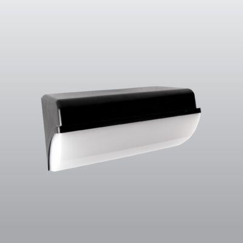{width=300px height=300px}
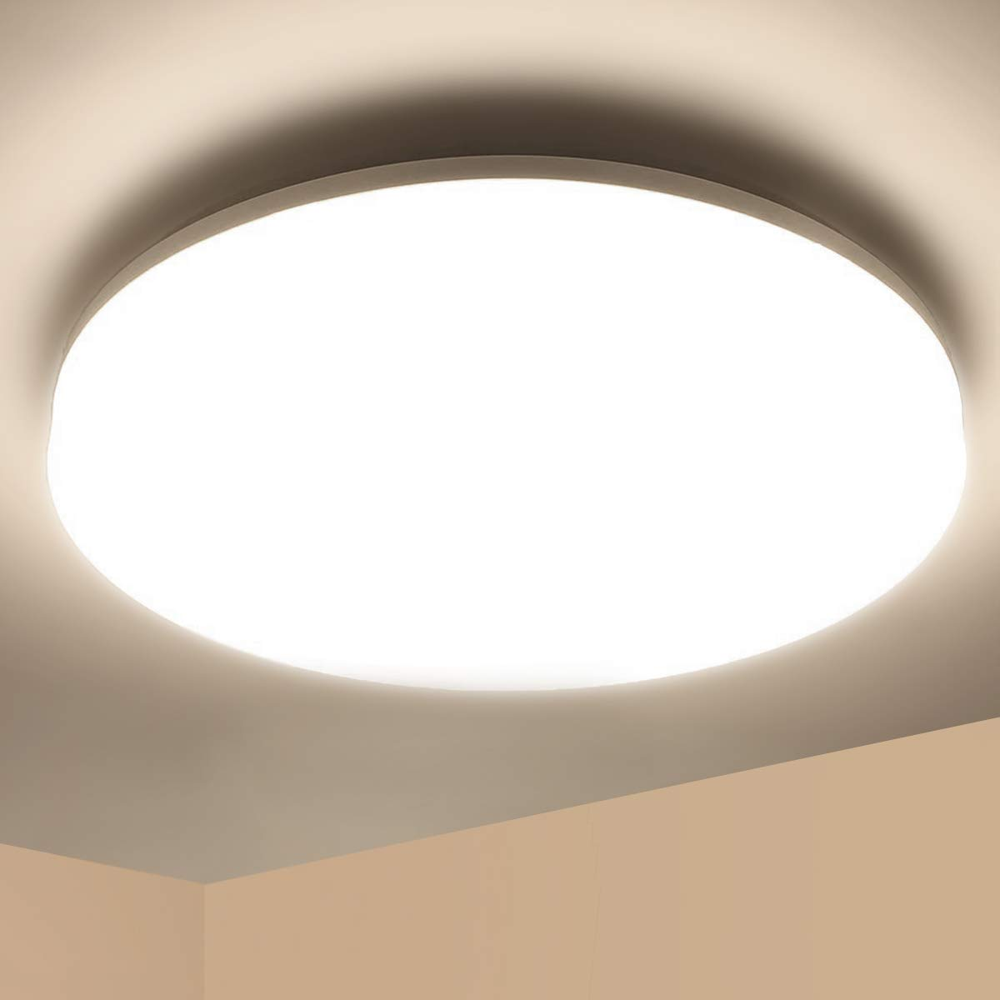{width=300px height=300px}

The 45-degree sconce provides higher directional efficiency, as the LEDs are oriented directly toward the target illumination zone from above. However, this design presents a more industrial appearance and is generally less universally appealing than circular luminaires. In contrast, the circular luminaire provides more uniform light distribution, resulting in a softer and more benign feeling. Based on aesthetic considerations and light uniformity, the circular lamp enclosure was selected.

The size of the fixture should not visually compete with the primary lighting fixture in the space, which typically has a diameter of approximately 30 cm. Since the proposed lamp produces significantly lower light output, a smaller form factor is required. Two candidate diameters—16 cm and 22 cm—were evaluated. The smaller fixture constrains LED placement, forcing the emitters to be positioned too closely together. This results in a concentrated, overly bright light source rather than a larger, more natural-looking illuminated area. Experimental evaluation showed that a 16 cm diameter enclosure is insufficient to achieve both a natural appearance and adequate light output at the same time. A 22 cm diameter enclosure represents an appropriate compromise between visual comfort and illumination performance.

An initial option considered was to fabricate the fixture using 3D printing, with the diffuser cut from a flat diffuser panel. This approach, however, is labor-intensive and restricts the diffuser to a planar geometry, limiting design flexibility. Moreover, such a construction lacks the aesthetic quality typically achieved by commercially manufactured luminaires. For these reasons, a commercially available 22 cm lamp enclosure was selected, with the original electronics removed and replaced by the proposed design. This approach also enables the development of multiple lamp variants sharing identical internal electronics.

A market survey was conducted focusing on enclosure quality, diffuser characteristics, and overall aesthetic appeal, while intentionally disregarding the original light quality, as the internal light source would be replaced.

**Luminaire:** CT-5664 - Cata<br>

::: {.callout-note collapse="false"}
#### Minor Deviation
For this revision, the **Philips Moire LED Ceiling Light White 6W 600lm** was used as the luminaire for all experiments, as it was readily available.

The power characteristics are measured below for reference:

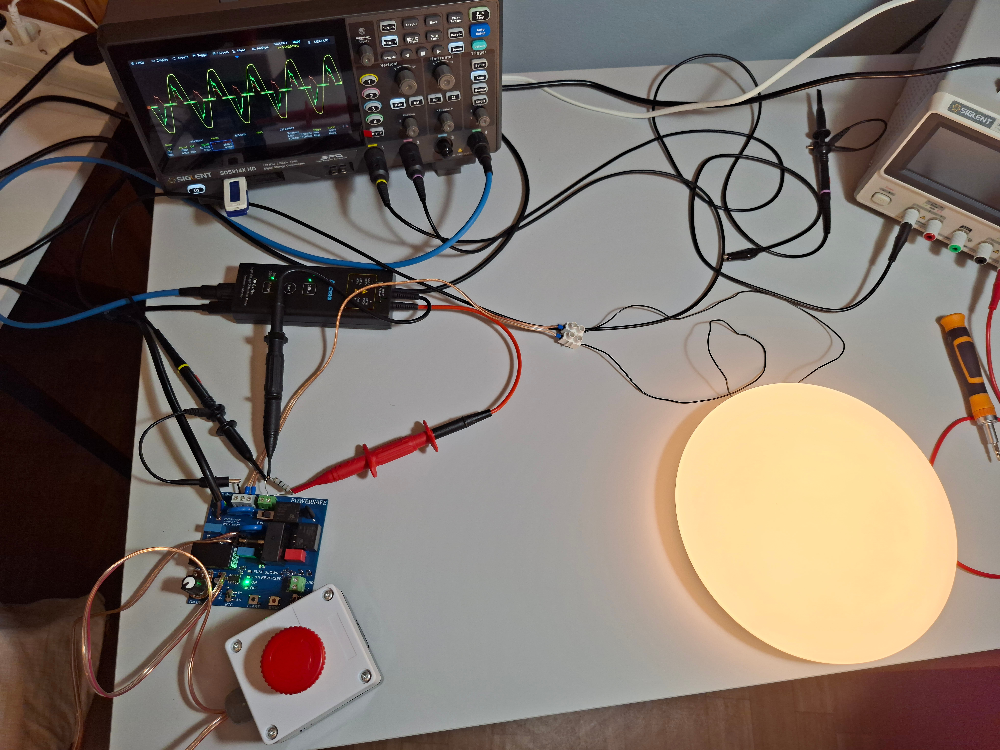

- Input Voltage -> CH1 - passive probe
- Input Current -> CH4 - differential probe (calculated from 10 Ω current sense resistor)
- VA (power) -> F1

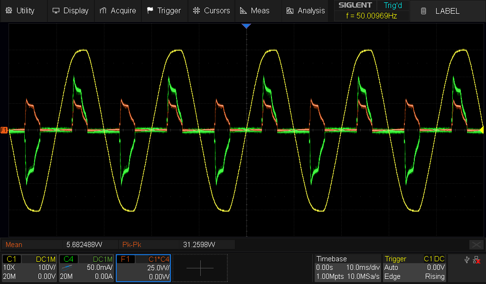


*Power Characteristics:*

- Real Power:

  $$
  P = 5.7\ \mathrm{W}
  $$

- Apparent Power:

  $$
  S = V_{\mathrm{RMS}} \times I_{\mathrm{RMS}}
    = 221.5 \times 0.037
    = 8.2\ \mathrm{VA}
  $$

- Power Factor:

  $$
  \mathrm{PF} = \frac{P}{S}
              = \frac{5.7}{8.2}
              \approx 0.70
  $$
<br>

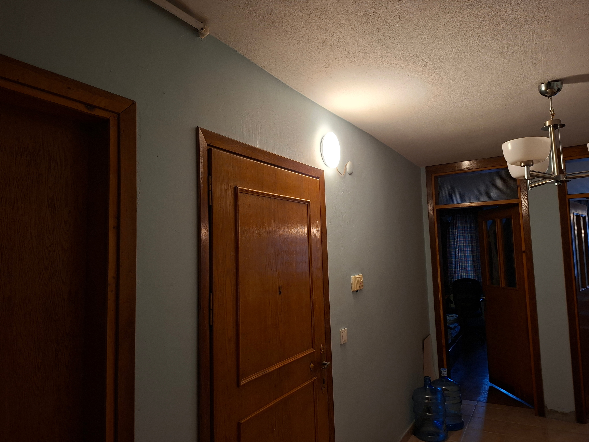
:::


# 5. FIRMWARE DESIGN

The MCU operates in a periodic wake–sleep cycle, waking every 250 ms to monitor ambient illuminance during occupancy which is sensed using a radar-based motion sensor. When motion is detected, the area is considered occupied and, if ambient illuminance checking is enabled, the MCU samples the ambient light level at predefined intervals. During illuminance sampling, the LEDs are briefly turned off (if currently on) to prevent self-illumination from affecting the measurement. Based on the measured illuminance and the user-configurable illuminance threshold, the MCU switches the LEDs on or off and sets the output brightness according to the user-adjustable potentiometer. If no motion is detected for a configurable duration, the MCU assumes the area is vacant and enters a deep sleep mode, remaining there until reactivated by motion.

A multifunction button is provided to configure system behavior. The button supports five configuration functions, which are selected based on how long the button is held. During function selection, the LED provides visual feedback by blinking to indicate the active mode. Once a function is selected, settings with multiple options are adjusted using short button presses and saved by holding the button.

## 5.1 Configuration

### 5.1.1 Button Configuration Mode Description

**1. Dark Illuminance Threshold (0 blinks):** Stores the ambient illuminance level below which the LEDs should turn on.

**2. Bright Illuminance Threshold (1 blink):** Stores the ambient illuminance level above which the LEDs should turn off.

**3. Ambient Illuminance Check (2 blinks):** Enables or disables ambient illuminance check. When disabled, the LEDs remain on as long as the area is occupied irrespective of ambient illuminance.

- 1 blink → Enabled
- 2 blinks → Disabled

Short Press: Increment Setting **|** Hold: Save and return to normal

**4. Vacancy Timeout Duration (3 blinks):** Adjusts the motionless duration required for the MCU to assume vacancy.

- 1 blink → 30 seconds
- 2 blinks → 2 minutes
- 3 blinks → 15 minutes
- 4 blinks → 48 hours
- 5 blinks → Infinite

Short Press: Increment Setting **|** Hold: Save and return to normal

**5. Breathing Mode (4 blinks):** Enables a decorative mode in which the LEDs fade in and out continuously.

Short Press: Return to normal

All user-defined settings are stored in EEPROM to ensure persistence across power cycles. The operation of the multifunction button and the associated configuration modes are illustrated in the flowchart below.

### 5.1.2 Button Flowchart
```{mermaid}
flowchart TD
    A[Initial Button Press] --> B{Count Pulses until Button<br>Release. How many?}
    B -- 0 --> G[Set the current illuminance<br>level as darkness threshold]
    B -- 1 --> H[Set the current illuminance<br>level as lightness threshold]
    B -- 2 --> I[Illuminance check Enabled<br>Settings]
    B -- 3 --> J[Vacancy Timeout Setting]
    B -- 4 --> K[Breathing Mode]
    G --> L[Return Normal Operation]
    H --> L
    I --> M[One blink: Enabled<br>Two Blinks: Disabled]
    M --Short Press--> N[Increment Setting]
    M --Long Press--> L
    J --> O[1 blink: 30 sec<br>2 blink: 2 mins<br>3 blink: 15 mins<br>4 blink: 48 h<br>5 blink: inf]
    O --Short Press--> N
    O --Long Press--> L
    K --Short Press--> L
```

## 5.2 Source Code
<details>
<summary><strong>Source Code (C++)</strong></summary>
```cpp

```
</details>

::: {.summary-box}
Bench Test Code: **4 – Redesign: Major Modification Required**

[Exp. 1 - MCU Logic Verification](#exp-mcu)
:::

# 6. BENCH TEST

## 6.1 Overview

After the PCB assembly is completed, design validation experiments are divided into two stages based on the power source: (1) External DC Power Supply and (2) AC Mains Supply.

In first stage, mains AC is not connected. Instead, the device is powered from an isolated laboratory DC power supply tapped into the 12 VDC and GND nets. This allows the low-voltage sections of the circuit to be validated safely before exposing the hardware to mains voltage. The regulated DC supply also eliminates the supply ripple inherent to the capacitive dropper, ensuring that measured behavior is not influenced by power-supply non-idealities. Firmware development and debugging are completed during this stage, as connecting a USB programmer to the non-isolated mains-powered circuit would connect the PC Earth to the circuit common, which fluctuates between Neutral and the negative peak of the Line voltage, almost certainly destroying the USB port, the programmer, or the DUT.

In the second stage, the laboratory power supply is disconnected and the device is powered from AC mains. All functions are verified under the intended operating conditions, including selected first-stage experiments whose performance may be affected by the capacitive dropper or mains-frequency ripple.

**Stage 1**

1. [MCU Logic Verification](#exp-mcu)
2. [Radar Sensor Sensitivity (External DC Supply)](#exp-radar-dc)
3. [Radar Sensor Power Rail Interference (External DC Supply)](#exp-radar-interference-dc)
4. [Ambient Light Sensor Electrical Characteristics (External DC Supply)](#exp-als-dc)
5. [Ambient Light Sensor Temperature Drift](#exp-als-temp)

**Stage 2**

6. [Capacitive Dropper Regulation](#exp-dropper)
7. [Maximum LED Current Selection](#exp-max-led-current)
8. [Radar Sensor Sensitivity (Mains AC Supply)](#exp-radar-ac)
9. [Radar Sensor Power Rail Interference (Mains AC Supply)](#exp-radar-interference-ac)
10. [Ambient Light Sensor Electrical Characteristics (Mains AC Supply)](#exp-als-ac)
11. [Gate Resistor Selection](#exp-gate-resistor)
12. [Zero-Cross Detection Divider Network](#exp-zcd)
13. [LED Driver Feedforward Resistor Effects](#exp-feedforward)
14. [LED Shunt Capacitor Effects](#exp-shunt-cap)
15. [Buck Converter Operation](#exp-buck-dtl)
16. [Power Factor Correction Effects](#exp-pf)

<br>


## 6.2 Experiments 

### 6.2.1 MCU Logic Verification {#exp-mcu .unlisted}

**Checklist:**

🗹 All setting modes are accessible and configurable.<br>
🗹 PWM frequency is approximately 2 kHz.<br>
⚠ PWM duty cycle varies linearly with the brightness potentiometer.<br>
🗹 Configuration settings are retained after a power cycle.<br>
🗹 The LEDs turn off after the configured timeout when no motion is detected.<br>
🗹 When the LEDs are on, the PWM output is disabled for approximately 5 ms during each ambient illuminance sample.<br>
🗹 The ambient illuminance threshold exhibits noticeable hysteresis, preventing flicker even when the ON and OFF thresholds are configured at the same illuminance.<br>
🗹 Motion detection resets the inactivity timer.<br><br>

**Potentiometer Dimming Behaviour:**

The potentiometer output (wiper) was probed under two conditions: while the shaft was manually rotated back and forth, which is expected to produce triangular waveforms. Potentiometer output was also recorded as it is kept stationary at the mid position, where the output is expected to remain constant. Instead, the potentiometer seems to have two distinct "moods." Sometimes it behaves exactly as expected, and sometimes it becomes completely unstable. The two responses shown below were captured without making any intentional change to the circuit, test setup, or operating conditions.

::: {layout-ncol=2}
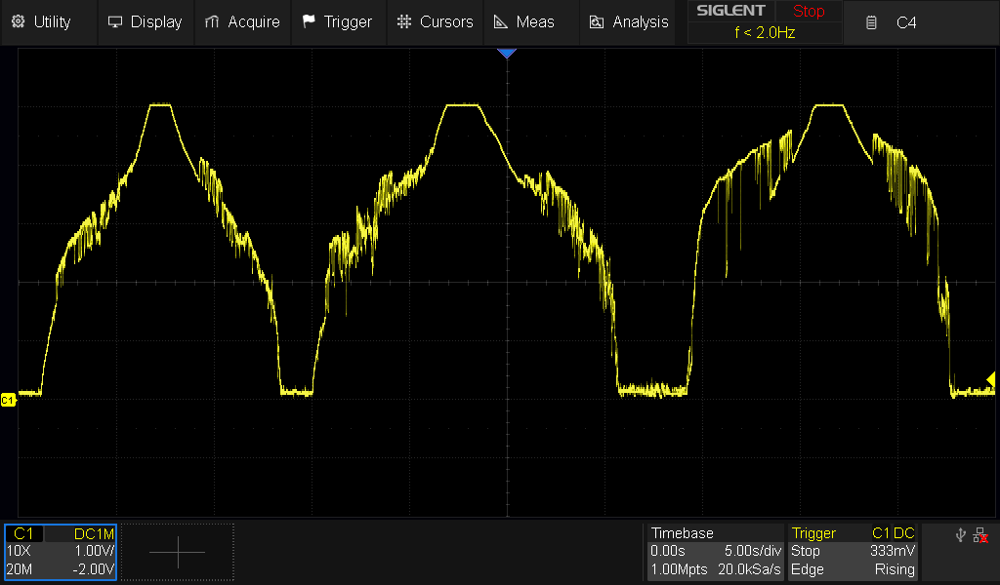

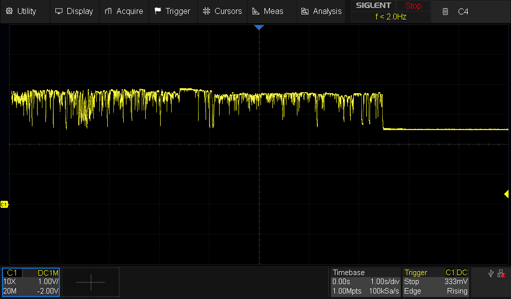

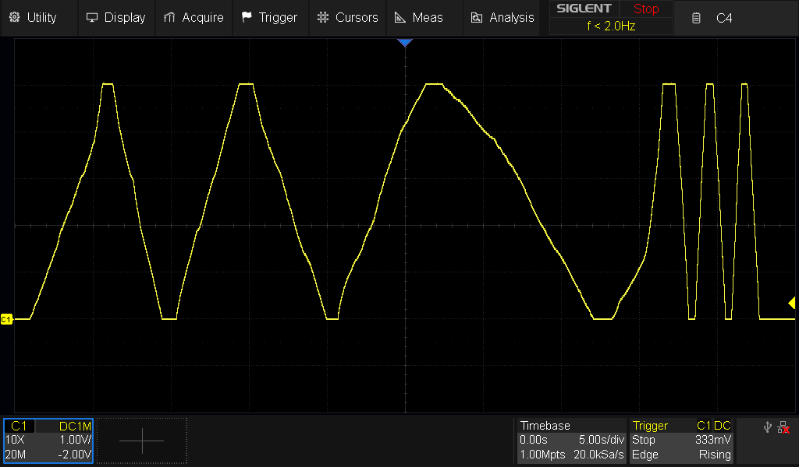
:::

In **Mood 1: Grumpy – Kept Steady**, it can clearly be seen that the signal recovered toward the end even though **nothing** was changed. The dimming behavior appears almost supernatural, but it has also been proven to be unreliable.

Potentiometers with resistance values ranging from **1 kΩ** to **100 kΩ** were tested, but the behavior remained mostly unchanged. The root cause could be ambient noise but remember the test is done without even powering the PWM circuit so there shouldn't be a significant noise source.

::: {.callout-important collapse="false"}
#### Major Modification & Failure with Unknown Cause
The potentiometer output sometimes exhibits excessive fluctuations  for an undetermined reason, preventing the dimming function from operating as intended. Refer to section [7.2.1 Dimming Method](#mjr-mod-dimmng) for the alternative method.
:::

### 6.2.2 Radar Sensor Sensitivity (External DC Supply) {#exp-radar-dc .unlisted}
**Procedure:** The circuit is covered with plastic diffuser and the output_voltage-to-GND of radar module (CH1 – passive probe) captured. Person passed from the field of view of the sensor in slow and fast speeds. If too sensitive, add a resistor to the programming pin.

**Results:** The radar sensor operated reliably throughout the test. No false trigger occurred. The only observed limitation was a trigger dead time of less than 10 s after each detection event, which is acceptable for the intended application.

### 6.2.3 Radar Sensor Power Rail Interference (External DC Supply) {#exp-radar-interference-dc .unlisted}

**Procedure:** First, the 12 VDC bus (CH4 – differential probe) is observed with and without the radar module connected to evaluate the radar module's effect on the power rail. Next, the radar module VCC (CH4 – differential probe) is observed to evaluate the effectiveness of the π filter in attenuating supply disturbances.

**Results:**

::: {layout-ncol=3}
/3.1 - 12 VDC Bus Radar Disconnected.png)

/3.2 - 12 VDC Bus Radar Connected.png)

/3.3 - Radar VCC-to-GND.png)
:::

No measurable power-rail noise introduced by the radar sensor was observed.

### 6.2.4 Ambient Light Sensor Electrical Characteristics (External DC Supply) {#exp-als-dc .unlisted}

**Procedure:** The PCB is covered with a diffuser to resemble intended luminaire operation. The ILLUMINANCE_AMBIENT (CH4 – differential probe) is captured while varying the ambient illuminance using an external ambient lighting. The sensor functionality, dynamic range and response time are evaluated. The sensor response time is measured by applying a step change from full brightness to full darkness resembling the sampling logic.

**Hypothesis:** The ILLUMINANCE_AMBIENT signal shall settle within 5 ms to changes in ambient illuminance and remain approximately linear over the intended operating range, saturating only outside an acceptable dynamic range.

**Results:**

*Functionality:* The output of the transimpedance amplifier reasonably responds to the changes in ambient illuminance produced by conventional light sources. However, due to its fast response, PWM-driven light sources such as smart LED bulbs produce significant ripple at the amplifier output. This behavior is illustrated in the four quadrants of the figure below:<br>
- Q1: Smart LED bulb only (380 mV<sub>pk-pk</sub>)<br>
- Q2: Conventional LED bulb only (120 mV<sub>pk-pk</sub>)<br>
- Q3: Both bulbs on<br>
- Q4: Dark environment (slight illumination from the monitor)<br>
- The blip between Q2 and Q3 is an acquisition mistake and should be disregarded.<br>

/4.2 - Light Sensor Response to Different Sources.png)

Therefore, the feedback capacitors should not be chosen unnecessarily small, as increasing their value reduces the bandwidth and consequently improves noise immunity.

*Dynamic Range:* The minimum measurable illuminance was found to be sufficiently low for the intended application. The maximum measurable illuminance, however, was found to be unnecessarily high. It already exceeds the illuminance level at which a user would reasonably decide to switch on the luminaire. Consequently, the amplifier sacrifices sensitivity at low illuminance levels to achieve a dynamic range that is not required. The design is therefore revised to reduce the upper measurement limit, thereby increasing the gain and sensitivity over the intended operating range.

::: {.callout-note collapse="false"}
#### Minor Modification
Refer to section [7.1.1 Ambient Light Sensor Modification](#minr-mod-AmbLightSens) for the modification of the upper measurement limit. The remaining experiments were performed using the revised values.
:::

*Response Time:* 
/4.1.1 - Light Sensor Step Change Response (39pF & 120pF).png)

The measured response time was approximately 1 ms, which is well below the 5 ms sampling duration. This indicates that the originally selected amplifier bandwidth was unnecessarily conservative. Consequently, the bandwidth can be reduced substantially, improving immunity to flicker and PWM-driven light sources while still allowing the amplifier output to settle well within the sampling window.

::: {.callout-note collapse="false"}
#### Minor Modification
Refer to section [7.1.1 Ambient Light Sensor Modification](#minr-mod-AmbLightSens) for the bandwidth revision of the transimpedance amplifier. The remaining experiments were performed using the revised values.
:::

*Response Time (revised):* 
/4.1.2 - Light Sensor Step Change Response (200pF & 560pF).png)

It can clearly be seen that the response time increased to approximately 3 ms, which is still below the 5 ms sampling duration. As a result of the modification, the ripple caused by the PWM-driven light source was reduced from 380 mV<sub>pk-pk</sub> to 125 mV<sub>pk-pk</sub>.


### 6.2.5 Ambient Light Sensor Temperature Drift {#exp-als-temp .unlisted}

**Procedure:** The goal is to determine the worst-case measurement error due to temperature. Set the threshold such that the LEDs remain off. Adjust the ambient illuminance until the transimpedance amplifier output is approximately 10% of its full-scale value (0.5 V), ensuring that the temperature-induced current represents a significant fraction of the measured signal while remaining within practical operating conditions. Keep the ambient illuminance constant throughout the experiment. Monitor the surface temperature of the photodiode with a thermal camera. Capture the output voltage of the transimpedance amplifier (CH4 – differential probe). Gradually heat the PCB using a hot plate powered from an adjustable power supply. Record the corresponding output voltage at different temperatures, then plot the transimpedance amplifier output voltage as a function of temperature.

**Results:**

*Experiment Setup:*

::: {layout-ncol=2}
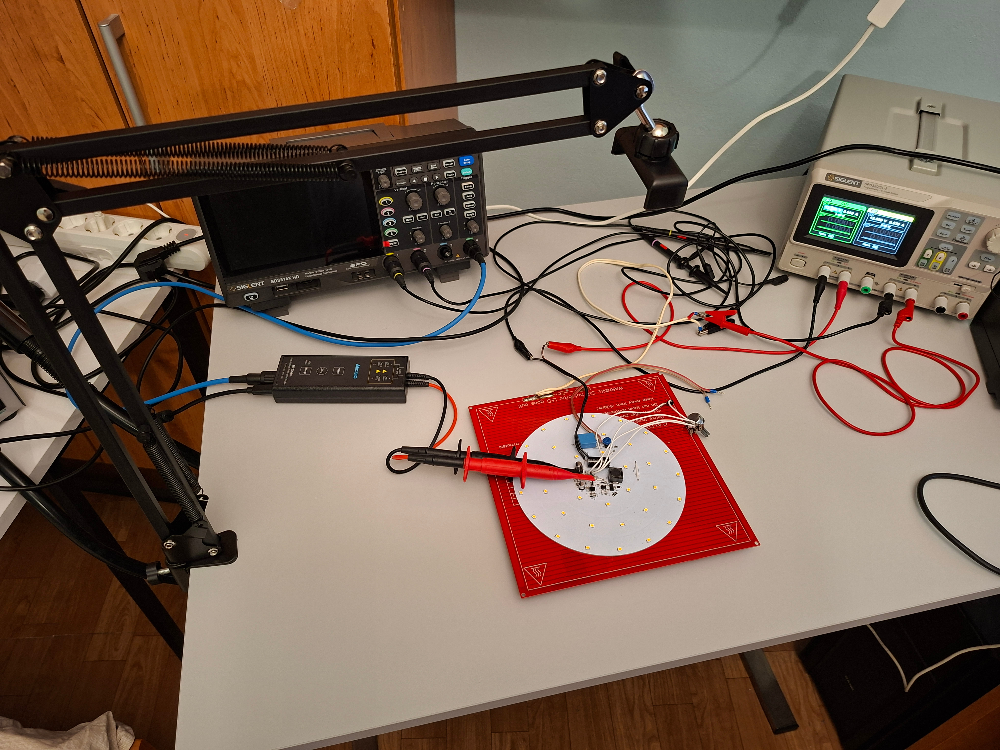

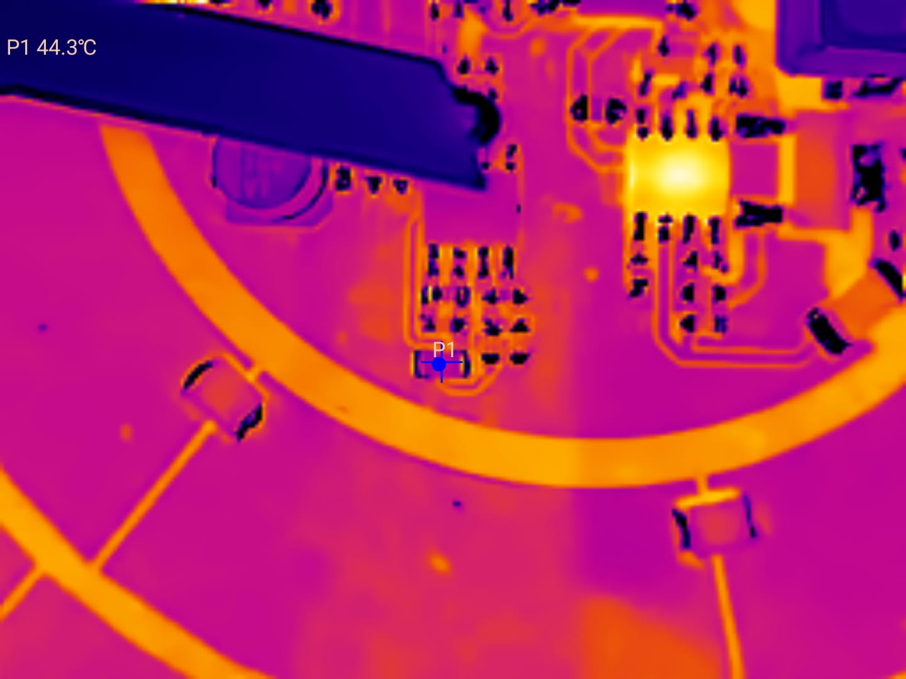
:::

*Scope Readings:*

::: {layout-ncol=2}

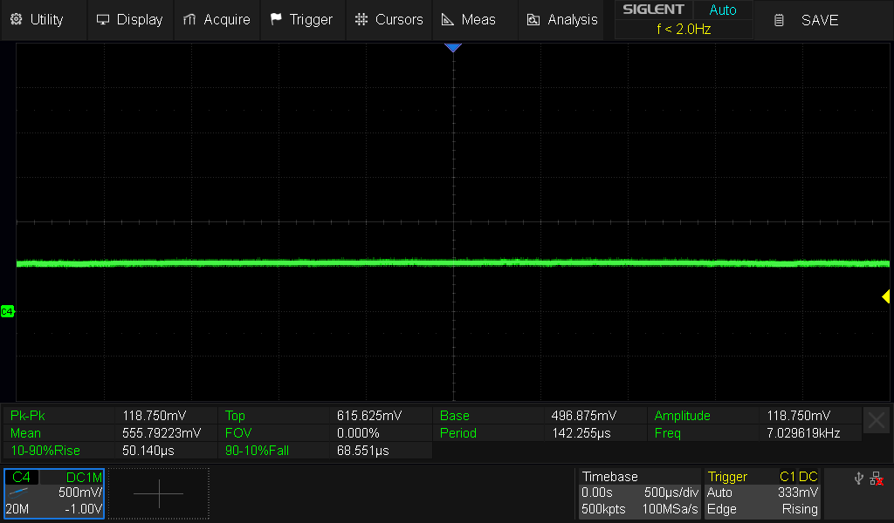

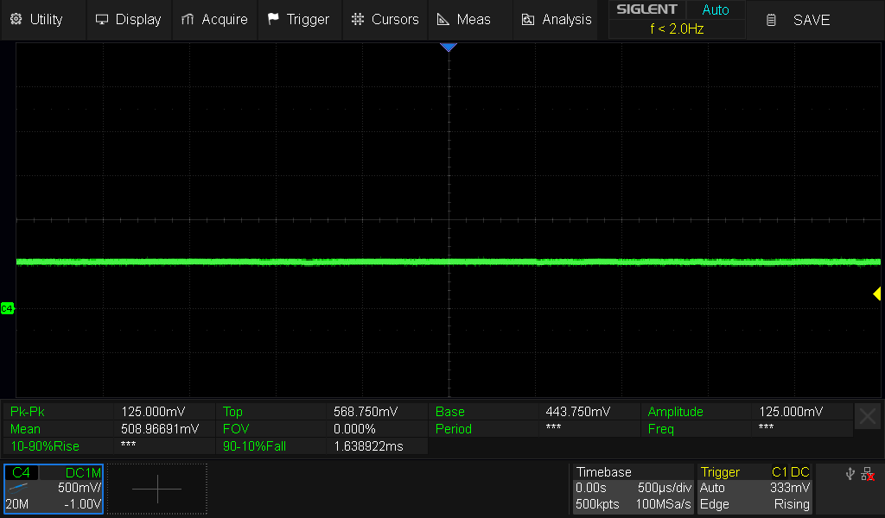

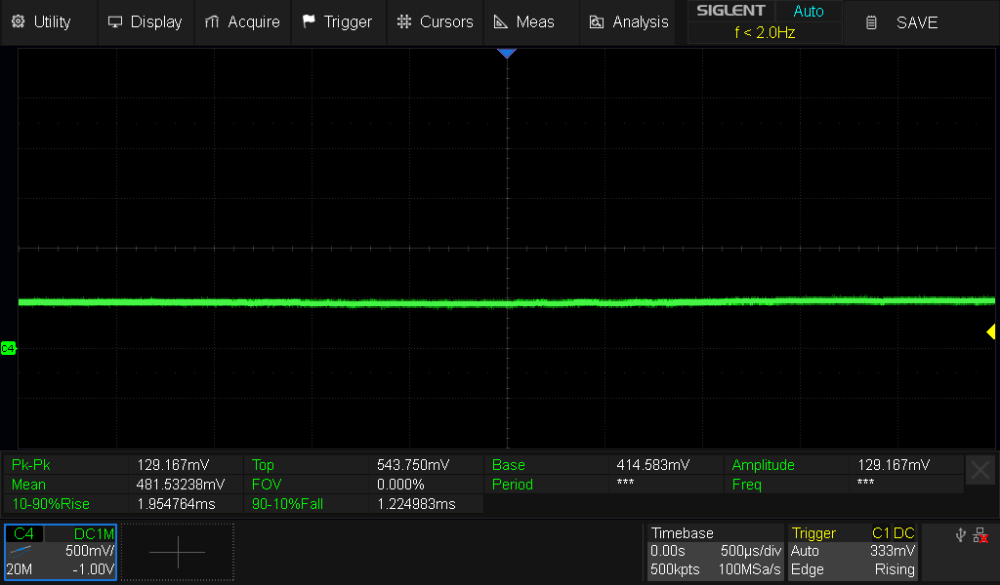

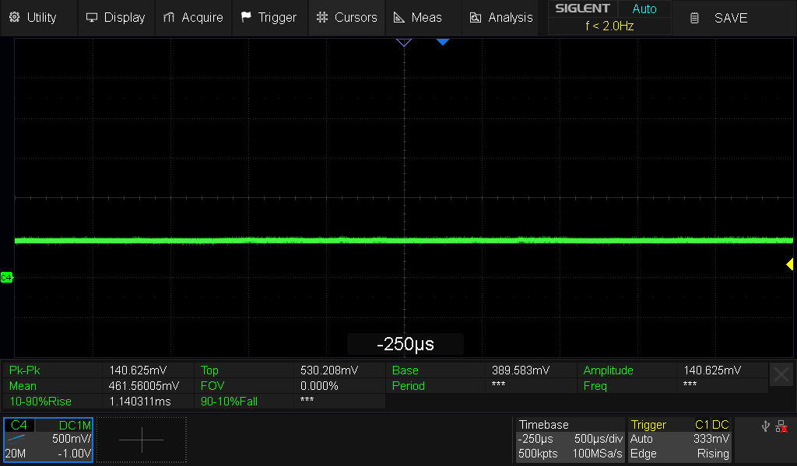

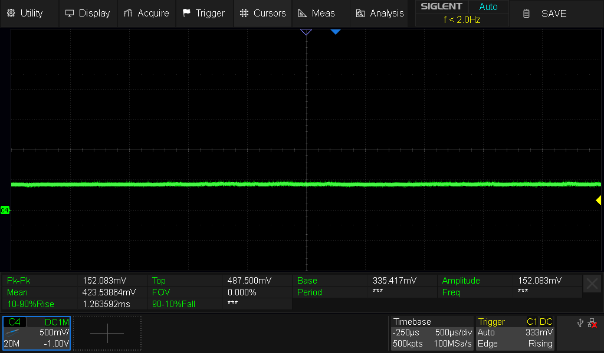

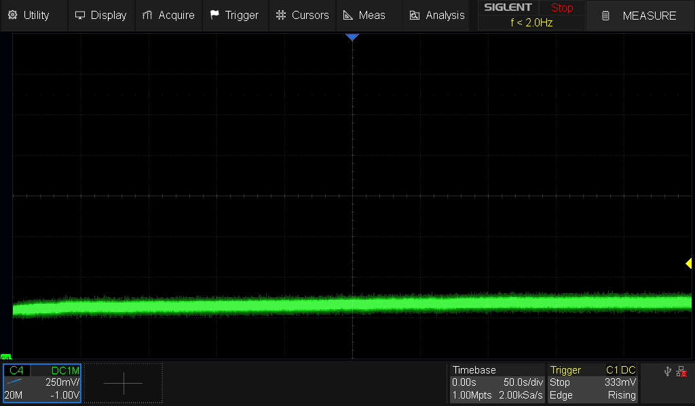
:::

*Drift Calc:*

```{python}
V27_8 = 0.555
V60_0 = 0.423

Temp_Drift_Percentage_Range1 = (V27_8 - V60_0) / Op2_Vo_MAX * 100

print(f"Temperature Drift from 27.8 °C to 60.0 °C Range = {Temp_Drift_Percentage_Range1:.1f}%")
```

Which is acceptable for the intended application.

### 6.2.6 Capacitive Dropper Regulation {#exp-dropper .unlisted}
**Procedure:** Capture the 12VDC Bus to GND voltage (CH4 - differential probe). Check if the voltage ripple complies with the design target of +-1.5V

**Results:**
The 63mA fuse on the mains switching element (PowerSafe) has blown and the trigger mode on the oscilloscope was *auto* instead of *single* therefore the event could not be captured. After the initial failure the experiment is modified as below:

- PowerSafe fuse is replaced with 0.5A fuse
- The current sense resistor (RCS) is enabled on the PowerSafe and a 10 Ω resistor is connected.
- The voltage drop on RCS is measured on CH4 - differential probe. The Line side is connected to the red probe and the circuit side is connected to the black probe.
- CH1 - passive probe is connected to circuit GND net.
- CH2 - passive probe is connected to the circuit +12V net.

The single triggered capture and moments of overcurrent are given below:

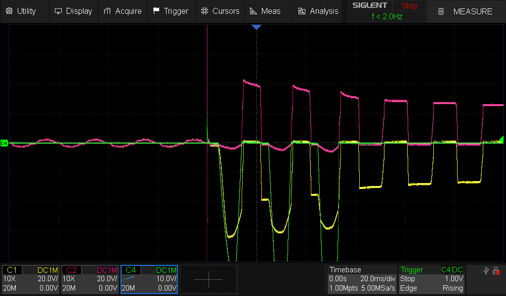

**FATAL FAILURE!** First of all, subtracting **CH2 − CH1** yields the capacitive dropper output voltage, which is expected to be approximately **12 V**. Instead, the waveform shows that the +12 V rail reaches approximately **40–60 V**, which would have instantly destroyed the entire control circuitry.

Furthermore, the measured input current is enormous. It is calculated by dividing the voltage across the current sense resistor (approximately **50 V**, although out of measurement range) by the **10 Ω** sense resistor, resulting in approximately **5 A**. The expected operating current of the device is only **30 mA** at most.

Clearly, something is going seriously wrong. This behavior cannot be explained by the inrush current associated with charging the input capacitor.

```{=html}
<video controls preload="metadata" width="800">
  <source src="../Experiments/6. Capacitive Dropper Regulation/6.3 Fuse Blown Instant.mp4" type="video/mp4">
</video>


<p><strong>Video: Fuse Blow Event</strong></p>
```

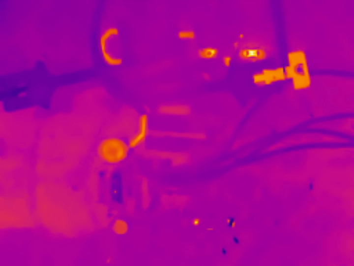

The heat signature shows that the 100 µF bulk capacitor (C3) and the input PFC resistor heat up almost instantly during startup. The heating of the PFC resistor is assumed to be normal, as the input capacitor is charged through it. However, the instantaneous 15 °C temperature rise of the 100 µF bulk capacitor (C3) on the +12 V rail, combined with scope results, is abnormal. Further investigation is needed beyond the scope of this experiment.

::: {.callout-important collapse="false"}
#### Major Modification & Failure
The overcurrent and +12 V rail overvoltage events are further investigated in section [7.2.4 Overcurrent and Overvoltage Failure Investigation](#ovc-ovv-inv)
:::


::: {.callout-warning collapse="false"}
#### Experiments Terminated
The Overcurrent and Overvoltage events resulted in destruction of the prototype and made it impossible to continue the remaining experiments. Therefore, the "**Results:**" sections of the following experiments are intentionally left empty.
:::

### 6.2.7 Maximum LED Current Selection {#exp-max-led-current .unlisted}
**Procedure:** The LED package temperature is monitored using a thermal camera while the LED current is gradually increased by reducing the current-sense resistor. Since the PCB has a relatively large thermal mass, the test is continued until thermal steady-state is reached after each current adjustment. The maximum continuous LED current is defined as the current at which the hottest LED junction reaches the design temperature specified in [Power Supply Parameters](#pwr-supply-param).

**Results:**


### 6.2.8 Radar Sensor Sensitivity (Mains AC Supply) {#exp-radar-ac .unlisted}

**Procedure:** Repeat experiment 2 under AC mains operation.

**Results:**

### 6.2.9 Radar Sensor Power Rail Interference (Mains AC Supply) {#exp-radar-interference-ac .unlisted}

**Procedure:** Repeat experiment 3 under AC mains operation.

**Results:**

### 6.2.10 Ambient Light Sensor Electrical Characteristics (Mains AC Supply) {#exp-als-ac .unlisted}

**Procedure:** Repeat experiment 4 under AC mains operation. This time, plot PWM signal (CH1 - passive probe) as well as the ILLUMINANCE_AMBIENT (CH4 – differential probe).

**Hypothesis:** Refer to experiment 4

**Results:**

### 6.2.11 Gate Resistor Selection {#exp-gate-resistor .unlisted}

**Procedure:** Starting from 6.8R for turn on and 6.8R // 10R = 4R for turn off, various resistors are to be tested until finding the match for the criteria described in the [gate resistor design section](#dsgn-gate-resistor).

**Results:**

### 6.2.12 Zero-Cross Detection Divider Network {#exp-zcd .unlisted}

**Procedure:** Drain-to-GND voltage (CH4 – differential probe), Rectified_AC_Bus-to-Earth voltage (CH2 – passive probe), and DRV-to-Earth voltage (CH1 – passive probe) waveforms are captured at PWM duty cycles of 0%, 5%, 50%, 95%, and 100%. After verifying quasi-resonant operation across the entire dimming range, the CSZCD-to-GND voltage is measured separately to confirm that it remains below the maximum allowable limit of 5.5 V.

**Hypothesis:** Immediately after the MOSFET turns off, the Drain-to-GND voltage is expected to rise to approximately the sum of the Rectified AC Bus voltage and the total LED forward voltage. As the inductor discharges, the Drain-to-GND voltage shall gradually decrease toward the Rectified AC Bus voltage. Upon reaching this level, the first resonant downslope caused by the inductor and parasitic capacitances is expected to occur. Near the minimum of this downslope, the DRV-to-Earth voltage shall rise, indicating that the MOSFET has turned on.

**Results:**


### 6.2.13 LED Driver Feedforward Resistor Effects {#exp-feedforward .unlisted}

**Procedure:** The converter is operated at 100% PWM duty cycle. The feed-forward resistor is configured as N.C., 10 MΩ, and 30 MΩ. For each configuration, the LED current (F1 – differential probe) and Drain-to-Source voltage (CH4 – differential probe) are measured separately. The three waveforms corresponding to each measurement type are overlaid for comparison.

**Results:**


### 6.2.14 LED Shunt Capacitor Effects {#exp-shunt-cap .unlisted}

**Procedure:** The converter is operated at 50% PWM duty cycle. A parallel LED shunt capacitor is connected across the LED string with the following values: 0 (N.C.), 22uF. For each configuration, the LED current (F1 – differential probe) and Drain-to-Source voltage (CH4 – differential probe) are measured separately. The two waveforms corresponding to each measurement type are overlaid for comparison.

**Results:**


### 6.2.15 Buck Converter Operation {#exp-buck-dtl .unlisted}

**Procedure:** The converter is tested at 0%, 10%, 50%, 80%, and 100% PWM dimming, as well as during startup. The output current (F1 – Differential Probe) waveform and PWM-to-earth voltage (CH1 - passive probe) are captured.

**Hypothesis:** The average LED current is expected to vary linearly with the PWM duty cycle. During startup, the output current shall reach its steady-state value without excessive overshoot, oscillation, or prolonged settling time.

**Results:**

### 6.2.16 Power Factor Correction Effects {#exp-pf .unlisted}

**Procedure:** The relationship between the input current waveform and the converter's input resistor is investigated. The current-sense resistor (RCS) of the PowerSafe module is configured as 1 Ω, and the voltage across it is measured (CH4 - differential probe) and expressed in amperes. The input_voltage-to-earth is simultaneously captured (CH1 - passive probe). Measurements are repeated with the input resistor equal to 0Ω, 22Ω and 33Ω. The power factor and wasted power are calculated for each configuration.

**Results:**

## 6.3 Tools

**Oscilloscope:** Siglent SDS824x<br>
**Differential Probe:** Micsig DP1500<br>
**DC Power Supply:** Siglent SPD3303x<br>
**Thermal Camera:** Thermal Master P3<br>
**Mains switching Element:** Powersafe (another project of mine). Power controller for mains-powered prototype boards. Features start/stop buttons, E-STOP, inrush current limiting (NTC), overcurrent protection (fuse), overvoltage protection (GMOV), and inductive kickback protection (Snubber). Also incorporates a two-input terminal for connecting current sense resistor.


# 7. Modifications

The proposed modifications are divided into two categories:

1. **Minor Modifications** that do not alter the original design objectives or fundamental design principles, and are therefore *implemented in the current revision.*
2. **Major Modifications** that require changes to the design assumptions, specifications, or core design principles. Although these modifications may be implemented immediately on the hardware, they invalidate the current design and therefore require a new design revision.


## 7.1 Minor Modifications

### 7.1.1 Ambient Light Sensor Modification {#minr-mod-AmbLightSens}

As concluded from [Experiment 6.2.4](#exp-als-dc) the following modifications were made:

- The maximum measurable illuminance was reduced from 200 lx to 110 lx.
- The 5× bandwidth margin was removed, allowing larger feedback capacitors to be used and thereby improving immunity to flicker and PWM-driven light sources.

###### Ambient Light Sensor Calculations:
```{python}
# PARAMETERS

# Photodiode Parameters:
I_10lx = 4e-9
I_110lx = 45e-9
Junction_Cap = 60e-12 # junction capacitance @Vref (10mV)

## Op-amp Parameters
Input_Cap_Diff = 8e-12 # Input Capacitance - Differential Mode
Input_Cap_Com = 7e-12 # Input Capacitance - Common Mode

# Circuit Parameters:
t_sense = 0.005 # Sensing duration
BW = 1/t_sense # Bandwidth, with no extra margin
Op2_Rfb = 1200000
Op2_inv_Rin = 47000
Op2_Vo_MAX = 4.9 # Limited to not saturate the output
Op1_Vo_MIN = Vref = 0.010 # Op-Amp_1 minimum output voltage, must be greater than minimum Output Voltage Swing


# CALCULATIONS
Op2_Gain = 1 + Op2_Rfb / Op2_inv_Rin
Op1_Vo_MAX = Op2_Vo_MAX / Op2_Gain # Op-Amp_1 maximum output voltage
Op2_Vo_MIN = Op1_Vo_MIN * Op2_Gain # Op-Amp_2 minimum output voltage

Op1_Rfb_Target = (Op1_Vo_MAX - Op1_Vo_MIN) / I_110lx
Op1_Rfb = 3900000
Op1_Cfb_MAX = 1/(2*pi*Op1_Rfb*BW)
Op1_Cfb = 200e-12
Op1_Output_Ratio = (I_110lx * Op1_Rfb + Vref) / Vref
Op1_GBP_MIN = (Junction_Cap + Input_Cap_Diff + Input_Cap_Com) / (2*pi*Op1_Rfb*Op1_Cfb**2) * 5 # Op-Amp minimum Gain-bandwidth product

Op2_Cfb_MAX = 1/(2*pi*Op2_Rfb*BW)
Op2_Cfb = 560e-12
Op2_GBP_MIN = Op2_Gain * BW * 5

R_Divider_Bottom = 2000
R_Divider_Top = (VDC_LOGIC-Vref)/Vref * R_Divider_Bottom


# DISPLAY
print(f"Op-Amp 1 Feedback resistor = {Op1_Rfb*1e-6:.1f} MΩ (Target: {Op1_Rfb_Target*1e-6:.3f} MΩ)")
print(f"Op-Amp 1 feedback capacitor = {Op1_Cfb*1e12:.0f} pF (MAX: {Op1_Cfb_MAX*1e12:.0f} pF)")
print(f"Op-Amp MIN Gain-bandwidth product = {max(Op1_GBP_MIN, Op2_GBP_MIN):.0f} Hz")
print(f"Op-Amp 2 feedback capacitor = {Op2_Cfb*1e12:.0f} pF (MAX: {Op2_Cfb_MAX*1e12:.0f} pF)")
print(f"Op1 Output Ratio = {Op1_Output_Ratio:.1f}, Op2 Gain = {Op2_Gain:.1f}")
print(f"\nTop resistor in reference voltage divider is calculated as {R_Divider_Top:.0f} based on chosen bottom resistor.\nThus the final divider becomes: 1M(Top) & {R_Divider_Bottom/1e3:.0f}k(Bottom)")

```

**Circuit Modifications:**<br>
- Op1_Rfb: 2.7M -> 3.9M<br>
- Op1_Cfb = 33pF -> 200pF<br>
- Op2_Rfb: 1M -> 1.2M<br>
- Op2_Cfb = 100pF -> 560pF<br>


## 7.2 Major Modifications

### 7.2.1 Dimming Method {#mjr-mod-dimmng}

As detailed in [Experiment 6.2.1 MCU Logic Verification](#exp-mcu), the root cause of potentiometer output fluctuations cannot be identified and resolved, the dimming method has to be revised to use either a push button that cycles through predefined brightness levels or a rotary encoder, which would require a larger-package MCU with additional GPIOs, such as the ATtiny404.

Another practical consideration is the physical size of the brightness adjustment hardware. The potentiometer is too large to fit inside every luminaire and would require significant modifications to the diffuser (cutting and drilling). A rotary encoder presents the same issue due to its similar dimensions, while also requiring additional I/O pins. Consequently, the potentiometer shall be replaced with a secondary push button for brightness control. The resulting user interaction logic is illustrated below.

```{mermaid}
flowchart TD
    A[First Button Press] --> B[Wait up to 1 second<br>for additional button presses]
    B --> C{Number of<br>Button Presses}

    C -- 1 --> D[Increase Brightness]
    C -- 2 --> E[Decrease Brightness]
    C -- 3 --> F[Set Maximum<br>Brightness]
    C -- 4 --> G[Set Minimum<br>Brightness]
    C -- Other --> H[Blink to<br>indicate Error]

    D --> I[Save to EEPROM<br>Return to Normal Operation]
    E --> I
    F --> I
    G --> I
    H --> I
```

The modified firmware source code is given below:

<details>
<summary><strong>Source Code (C++) - Revised but Untested</strong></summary>
```cpp

```
</details>

### 7.2.2 Maximum LED Current
Refer to [6.2.7 Maximum LED Current Selection](#exp-max-led-current)

### 7.2.3 LED Footprint
LED footprint pads should be enlarged. Refer to [Post Assembly Notes](#post-assembly-notes) in Section 3.

### 7.2.4 Overcurrent and Overvoltage Failure Investigation {#ovc-ovv-inv}

**Question:** How can the circuit attempt to draw as much as **5 A** for multiple AC periods?
**Note:** 630mA fuse blows with a spark in each and every experiment unless indicated otherwise.


#### 7.2.4.1 Extent of the Damage{.unlisted}
Assess the extent of the damage using a continuity test and by applying the rated voltage to the respective components while monitoring the current draw. Remove the dropper loads (PMIC (U3), LDO (U2), and their decoupling capacitors) for an isolated test. Replace the 100 µF capacitor (C3) and TL431 (U1), as they may have been damaged. Measure the bridge rectifier using the multimeter’s diode test function and replace it if any junction is found faulty. Verify the health of the PFC resistor (R1) and the capacitive dropper inrush resistor (R2), and replace them if necessary. Confirm that no unintended short circuit remains before proceeding.

*Result:*

- R1 was found open-circuit and replaced.
- The dropper loads PMIC (U3) and LDO(U2) were not replaced, as the measured +12 V rail current draw was significantly below their normal operating current, indicating that they were likely non-functional and would not affect the measurements.
- TL431 (U1) and the 100 µF input capacitor (C3) were replaced.
- No other issues were found, including diode damage, capacitor anomalies, or unintended shorts.
- After replacing TL431 (U1), its clamping performance was tested by applying an external 12 V supply to the rail and gradually increasing the current with a current limit to prevent damage. The TL431 successfully clamped the rail at 12.13 V.

#### 7.2.4.2 Determine Which Branch Is the Culprit{.unlisted}
Measure the voltage drop across *R1* and *R2* during startup to identify which branch is drawing the excessive current. The thermal camera suggests that the capacitive dropper branch is the primary suspect.

*Result:*

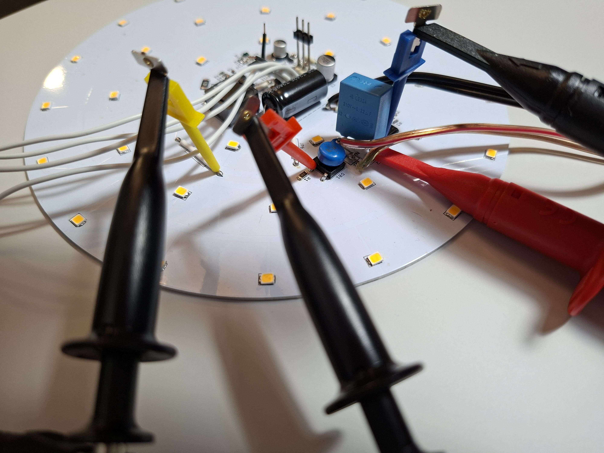

- CH1 (passive probe): Upstream of R1
- CH2 (passive probe): Downstream of R1
- F1: R1 current | Formula: `(CH1-CH2)/33`
- CH4 (differential probe): R2 current — **9.4 V/A** *(50× probe attenuation with a 470 Ω resistor: $(50/470)^{-1}=9.4$)*


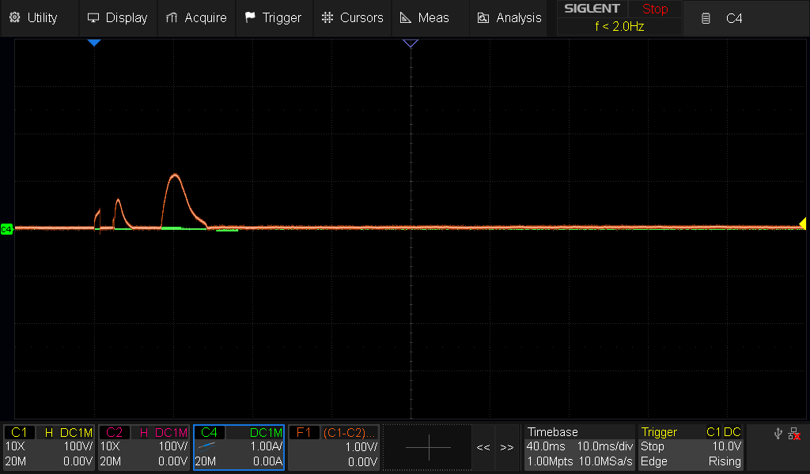

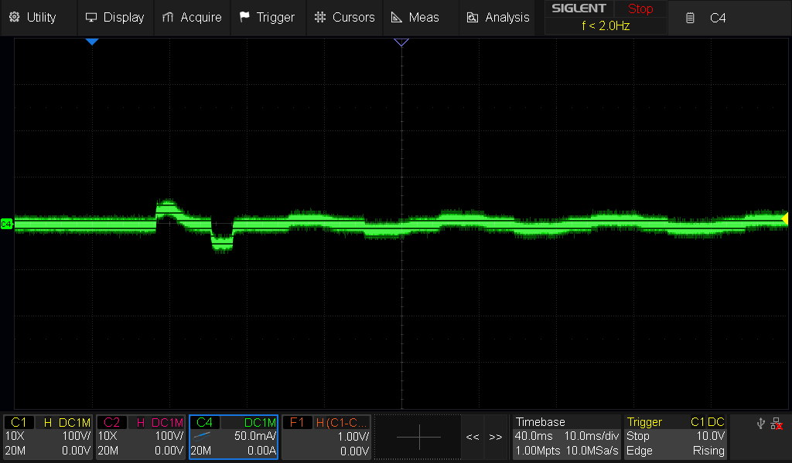

To verify whether the overcurrent event had also affected the capacitive dropper branch, the TL431 clamping test was repeated. The power supply reached its **30 mA current limit at only 4.7 V** instead of a little over 12V, confirming that the branch had been seriously damaged. Consequently, the fault is confirmed to involve both the capacitive dropper branch and the buck converter branch. Both branches are investigated separately.


#### 7.2.4.3 Buck Converter Branch Voltage and Current{.unlisted}
**Question:** What is drawing so much current?


As long as the MOSFET is kept off, the only component that can draw current is the input capacitor **(C1)**. The voltage and current at the buck converter input are captured below.

- CH1 (passive probe): Upstream of R1
- CH2 (passive probe): Downstream of R1
- F1: R1 current | Formula: `(CH1-CH2)/33`
- CH4 (differential probe): C1 input cap

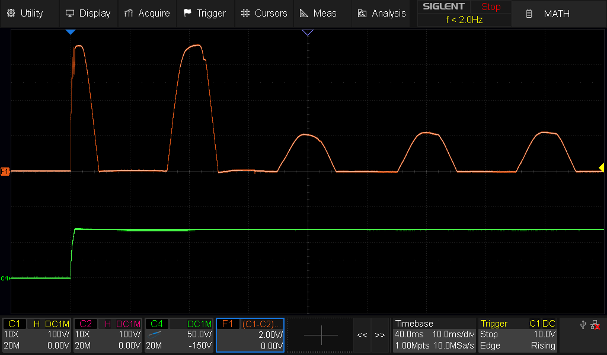

The input voltage is clamped at 67.5 V, which is unexpected. However, it is realized that the control circuit is non-functional, leaving the MOSFET gate without active control. The gate may therefore be floating, and charging of the drain-source capacitance could cause the MOSFET to partially turn on. The gate resistors **R6** and **R7** are removed to disconnect the gate from the driver circuit, and a copper wire is soldered between the gate and source to ensure that the MOSFET remains off. The experiment is then repeated:

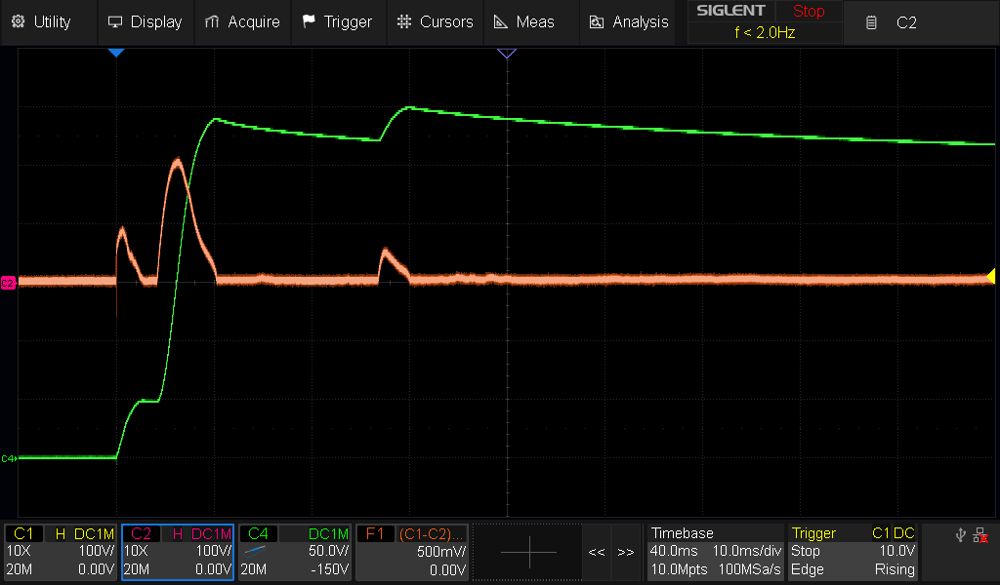

As the MOSFET is kept off, the capacitor charges to its full voltage. The current peaks at 1 A, but only during the input capacitor charging period. Once the capacitor is charged, the current draw follows a typical fully rectified AC input waveform with relatively small peaks, which does not explain why the fuse continues to blow.


#### 7.2.4.4 Cap Dropper Voltage and Current{.unlisted}
Remove R1 to stop current flow to the buck converter branch and observe the cap dropper branch independently.

- CH1 (passive probe): +12V rail
- CH2 (passive probe): GND
- F1: Cap Dropper Output Voltage | Formula: `(CH1-CH2)`
- CH4 (differential probe): R2 current | Formula: `9.4 V/A`

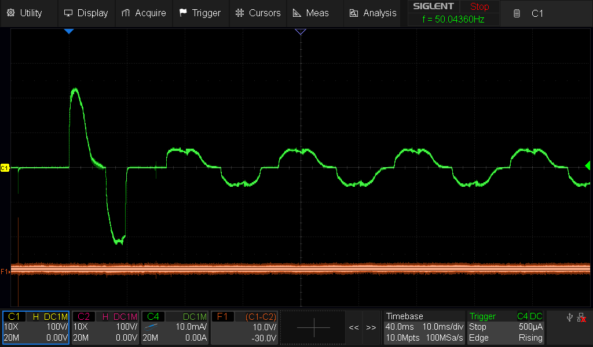

The steady-state current peak is only 5mA indicating the cause of overcurrent is not the capacitive dropper.


**Experiment 3 & 4 Conclusion:** Neither the capacitive dropper nor the buck converter is individually responsible for the overcurrent. However, when both branches are connected, the overcurrent occurs. The results indicate that something more sinister is going on.

#### 7.2.4.5 Narrowing Down the Root Cause{.unlisted}
To systematically eliminate possibilities, the input components are removed one by one.

- R1 had already been removed from the previous experiment: **Fuse Blown** ❌
- GMOV (RV1) was removed: **Fuse Blown** ❌
- Rectifier diode (DB1) was removed: **Fuse Remained Intact** ✅
- Rectifier diode (DB1) was replaced with a new one: **Fuse Blown** ❌
- Pin 3 (NEUT) of the rectifier diode (DB1) was lifted: **Fuse Blown** ❌
- Both pin 3 (NEUT) and pin 4 (LINE) of the rectifier diode (DB1) were lifted: **Fuse Remained Intact** ✅

The results were confusing because how could a brand-new 1000V-rated rectifier diode play a role in overcurrent event? The results were shared with Gemini AI for further analysis. Surprisingly, it was remarkably successful in diagnosing the problem. The culprit has finally been caught. It was not some complex engineering issue; it had been hiding in plain sight all along. <br>

::: {.callout-note collapse="false"}
#### Root Cause: Direct Mains Short-Circuit Through the Bridge Rectifiers
The reason the fuse blows is that the AC input connections of *DB1* and *DB2*, together with their common *GND* connection, create an unintended direct short-circuit path across the 230 V mains. This forms a *diode short-circuit loop* that completely bypasses the current-limiting components of the capacitive dropper.
:::

**Step-by-Step Short-Circuit**

During the half-cycle in which LINE is negative with respect to NEUT:

1. Current enters through the NEUT line and reaches pin 3 of DB2.

2. The internal diode between DB2 pin 3 (NEUT) and pin 1 (+12 V) becomes forward-biased, allowing current to flow onto the +12 V rail.

3. The current flows through the components connected to the +12 V rail, including C3 and the associated circuitry, and reaches the common GND rail connected to pin 2 of both DB2 and DB1.

4. From the GND rail, the current flows through the internal diode between DB1 pin 2 (GND) and pin 4 (LINE), which is forward-biased during this half-cycle.

5. The current then returns directly to the LINE conductor without passing through the capacitive dropper, completing an unintended low-impedance short-circuit path across the mains.

> **Summary:** The current-limiting C2 capacitor and R2 resistor are connected to pin 4 (LINE) of DB2. However, the fault current enters DB2 through pin 3 (NEUT) and exits through DB1 pin 4 (LINE). Therefore, C2 and R2 are completely bypassed by this current path. The 230 V mains voltage is consequently applied across the circuit through only the forward voltage drops of the two bridge-rectifier diode paths and the impedance of the connected circuitry, resulting in a very large current that immediately blows the fuse.


#### Alternative Design Solutions:{.unlisted}

- **Buck Version of Dickson Charge Pump Topology [Most Practical]:** The negative half-cycle is not actually mandatory for a capacitive dropper to function, as long as the input voltage is continuously varying. Instead of using a separate bridge rectifier for the capacitive dropper, the rectified AC waveform available at the primary bridge rectifier output can be used. To achieve this, the rectified AC and filtered DC nodes shall be separated by a diode. In addition, the +12 V rail shall only draw power and must not supply power back into the buck stage. Therefore, two additional diodes are used to control the charge and discharge paths of the dropper capacitor. The simulation below compares the failed design with the proposed topology:

[](../Simulation/Cap Dropper with Single Bridge Rectifier/Cap Dropper with Single Bridge Rectifier Simulation Screenshot.png)

- n008: D12_Cathode
- n006: D12_Anode (GND of the new topology)
- n010: D11_Cathode
- n012: D11_Anode (GND of the old topology)

    The voltage differences $(n008-n006)$ and $(n010-n012)$ shall be compared to evaluate the regulation performance. The two waveforms are similar, verifying the proposed topology in simulation. One notable difference is the required increase in dropper capacitance from *220 nF to 4.7 µF*, corresponding to approximately a *21× increase*. This is not particularly surprising, since the dropper input voltage has a lower peak-to-peak amplitude in the proposed topology and the capacitor discharge no longer contributes to the +12 V rail but instead discharges through the buck converter, leaving only the charging portion to supply the +12 V rail. Fortunately, since the capacitor is only subjected to a single polarity of voltage in this topology, an electrolytic capacitor can be used, making the higher capacitance requirement trivial. Additionally, this is only a crude simulation, so the final capacitance value shall be determined empirically. The inrush-limiting resistor (R1 in the simulation) shall also be carefully determined and may need to be reduced because the effective frequency is doubled, reducing the discharge interval, while the increased capacitance increases the RC time constant.

- **Separate the Ground Connections:** If separate bridge rectifiers are used for the main power supply and the auxiliary/bias supply on the mains side, their DC-side *GND* connections shall not be directly connected. Each bridge rectifier shall maintain its own separate DC return path.

- **Use Symmetrical Capacitive Dropper on LINE and NEUTRAL:** The current-limiting components (C2 and R2) shall be placed symmetrically in both the LINE and NEUTRAL paths. This ensures that the capacitive impedance is present in either possible current path and prevents the bridge rectifiers from bypassing the current-limiting impedance through their common *GND* connection.

- **Replace the Capacitive Dropper with a High-Voltage Linear Regulator:** This is the simplest approach. It involves removing the capacitive dropper and the second rectifier, and connecting a high-voltage linear regulator directly to the rectified AC node (**~325 VDC**). However, this approach significantly reduces efficiency and is therefore impractical for relatively high input currents such as those required by the PMIC used in this design. At the current operating point, the linear regulator would dissipate approximately **3.5–4 W** as heat.


#### 7.2.4.6 Verifying the Verdict{.unlisted}
Verify the cause of the problem by only breaking the current path at the NEUT pin of the capacitive dropper bridge rectifier (DB2) while keeping the rest of the circuit original. DB1 and R1 are resoldered, while only pin 3 of DB2 is lifted.

- CH1 (passive probe): Upstream of R1
- CH2 (passive probe): Downstream of R1
- F1: R1 current | Formula: `(CH1-CH2)/33`
- CH4 (differential probe): C1 input cap

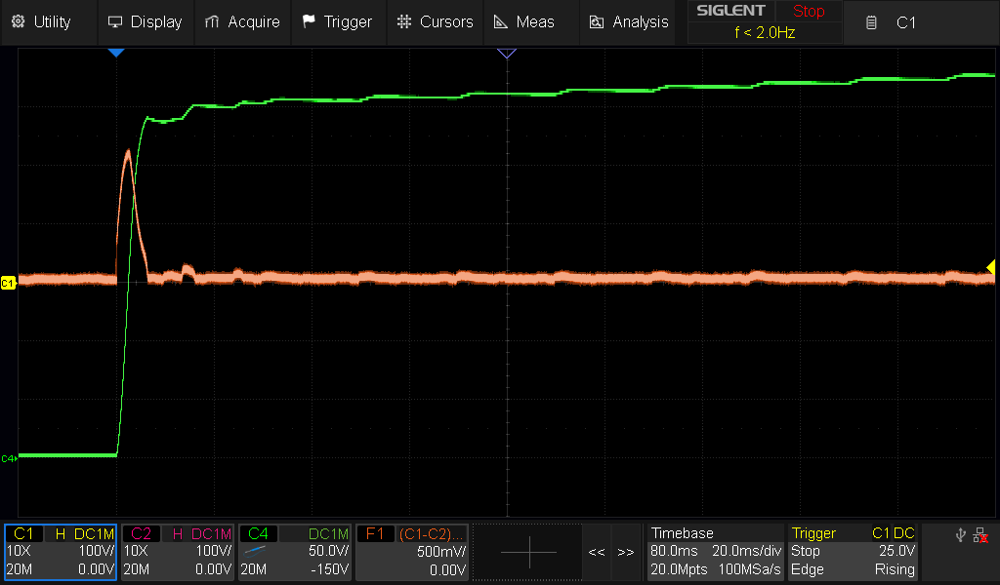

The fuse did not blow, and the expected waveforms were obtained.

**Extra Conclusion:** Even though the MOSFET gate and source are shorted, forcing the MOSFET off, the LEDs continued to emit a small amount of light. Refer to [7.2.5 Ensuring the LEDs Turn Fully Off When the MOSFET Is Off](#led-trn-off).


#### 7.2.4.7 Eliminating the Capacitor as the Suspect{.unlisted}
Because the first noticeable symptoms were the failure of the control circuitry and the +12 V rail reaching abnormally high voltages during the initial overcurrent events, the dropper capacitor (C2) became the primary suspect. To eliminate this legacy hypothesis as a potential point of failure, the health of the series capacitor in the capacitive dropper is verified.

*Theory:*

The theoretical value of the capacitor reactance is given below:

$$
X_{C,\mathrm{theory}}=\frac{1}{2\pi fC}
=\frac{1}{2\pi\cdot50\cdot220\,\mathrm{nF}}
=14.5\,\mathrm{k}\Omega
$$

Also, an ideal capacitor current leads the capacitor voltage by **90° (π/2)**.
<br><br>

*Measurements:*

Since the fuse no longer blows, the capacitive reactance can be calculated using the RMS values below instead of the peak values from the first few cycles:

$$
I_{C,\mathrm{RMS}}=\frac{V_{RCS,\mathrm{RMS}}}{R_{CS}}, \qquad
X_{C,\mathrm{meas}}=\frac{V_{C,\mathrm{RMS}}}{I_{C,\mathrm{RMS}}}
$$

Apply the mains voltage directly across the dropper capacitor (C2) and R2 and measure **Voltage Across the Capacitor** and **Current Through the Capacitor**.


*Result:*

- CH1 (passive probe): Line
- CH2 (passive probe): Node between capacitor (C2) and resistor (R2)
- F1: Capacitor (C2) Voltage
- CH4 (differential probe): R2 current | Formula: `9.4 V/A`

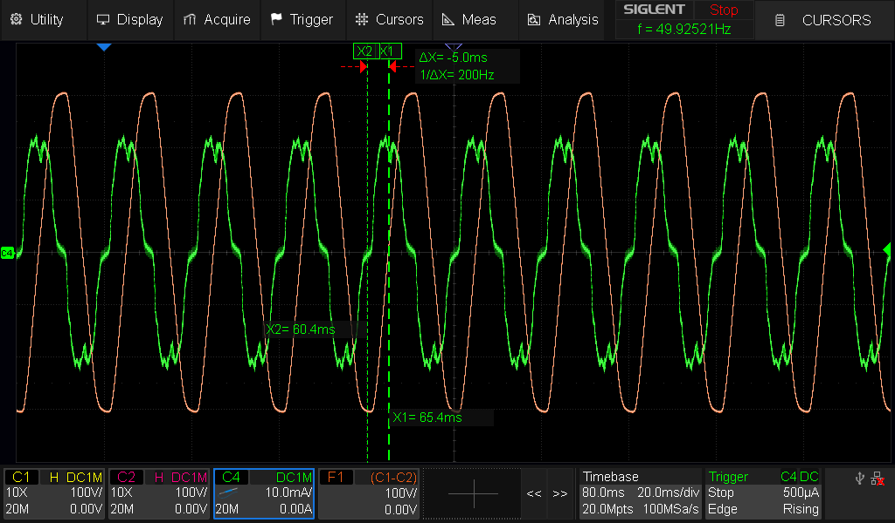

*Results:*

- $V_{\mathrm{RMS}} = 224.8\,\mathrm{V}$
- $I_{C,\mathrm{RMS}} = 15.3\,\mathrm{mA}$
- $R = 470\,\Omega$
- $X_{C,\mathrm{meas}} = \frac{224.8}{0.0153} = 14.7\,\mathrm{k}\Omega$ *(agrees with the theoretical value)*

The cursors show the zero-crossing points. The measured phase difference is *5 ms*. Since the period is *20 ms*, this corresponds to a phase difference of

$$
\Delta\phi = 2\pi\frac{5\,\mathrm{ms}}{20\,\mathrm{ms}}
= \frac{\pi}{2}
$$

which agrees with the theoretical *90° phase shift* of an ideal capacitor. The results confirm that the capacitor is healthy.

### 7.2.5 Ensuring the LEDs Turn Fully Off When the MOSFET Is Off {#led-trn-off}

LEDs can light up with extremely small currents, so a bleeder resistor in parallel with the LED string is required to divert these leakage currents away from the LEDs, as done in the *100-W Quasi-Resonant (QR) using NCL30076 - TND6338/D* application note.
<br><br><br><br>

#### Last Words from the Author{.unlisted}

I've been intrigued by the idea of making the perfect nightlight, even though it is a simple concept. Not only because we really need one at home (although it is certainly not something we cannot live without), but also because I knew it would teach me a lot.

I worked with circuits I had never designed before, such as a non-isolated buck converter, an amplifier with settling time requirement and capacitive dropper. I learned about quasi-resonant operation, photodiodes, the difficulty of soldering on aluminum PCBs (and the importance of using thermal relief, at least on aluminum PCBs), custom rules in KiCad and of course my dear parallel bridge rectifiers. There are many more that I have already forgotten to count. These were only the electronics.

The project also opened the doors for me to Markdown, Quarto, and repository creation on GitHub. This project took a lot of time and delayed some of my other projects, but I'd say it was worth it.

As for the functionality, well, the root cause of the failure turned out to be much simpler than I initially thought. I am a little embarrassed about it, but it is what it is.

Since my project didn't work, I've simply modified the Philips luminaire by increasing its current-sense resistor, which decreased its brightness. Right now, it consumes about 3 W and lights up exactly as I wanted. Yes, it does not turn off when nobody is around, it is probably less efficient, and it does not turn off when the ambient is already bright. But who cares? It is just 3 W.

I am not planning to make a Revision B, as I have more important projects waiting. I'm pocketing the experience and moving on.

Thank you for your interest in my report. I tried to make something uncommon, and instead of writing an application note, I wrote a technical diary. I hope you enjoyed it.